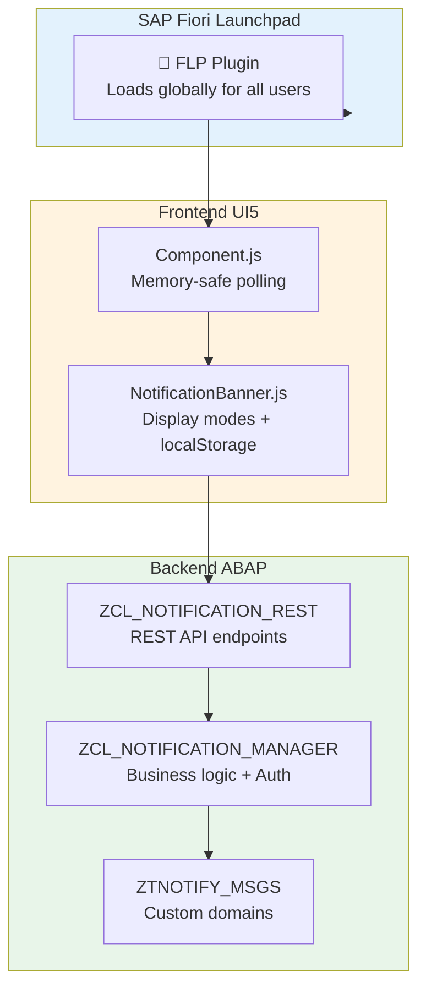

# 🔔 SAP Fiori Global Notification Banner

[](https://www.sap.com/)
[](https://ui5.sap.com/)
[]()
[]()

A comprehensive global notification banner system for SAP Fiori applications on S/4HANA. Display urgent system messages, maintenance notifications, and alerts across all Fiori apps with a unified, responsive, and accessible banner component.

---

## 🚀 Features

### Core Features
- **🌐 Global Display** - Appears on all Fiori applications via FLP Plugin
- **📱 Responsive Design** - Optimized for desktop, tablet, and mobile
- **🎨 Multiple Themes** - Supports all SAP Fiori themes and dark mode
- **♿ Accessibility** - WCAG 2.1 AA compliant with screen reader support
- **🔄 Real-time Updates** - Automatic polling for new notifications (30s)
- **🎯 Priority Levels** - High, Medium, Low with distinct color-coding
- **🔒 Security** - Role-based authorization, CSRF protection, XSS prevention
- **🌍 Internationalization** - Multi-language support ready

### 📺 Display Modes (v1.1.0+)
Choose how notifications appear to users:

| Mode | Behavior | Use Case |
|------|----------|----------|
| 🎯 **BANNER** | Fixed top banner, user must close | Critical announcements requiring acknowledgment |
| 💬 **TOAST** | Bottom-right toast, auto-dismiss 5s | Non-intrusive updates, confirmations |
| 🎪 **BOTH** | Banner + Toast simultaneously | Maximum visibility for important messages |
| 🔇 **SILENT** | Logged only, no UI display | Audit trail, compliance monitoring |

### 📊 Dynamic Tile Counter (v1.1.0+)
- Real-time statistics: "10 Active | 3H|5M|2L"
- Color-coded by highest severity (RED/ORANGE/GREEN)
- Auto-updates every 60 seconds
- Disabled in plugin mode (global loading)

### 🆕 v1.2.0 Highlights
- ✅ **SAP Logging Standard** - Replaced console.log with sap/base/Log
- ✅ **Memory Leak Fix** - Proper cleanup of setInterval in Component.exit()
- ✅ **Code Quality** - ESLint compliant, SAP best practices applied
- ✅ **Documentation Restructure** - Separated backend/frontend guides, modern SAP approaches only
- ✅ **3-State Filters** - Admin UI with All/Active/Inactive filtering

---

## 📁 Project Structure

```
sap-fiori-notification-banner/
├── 📄 package.json              # Dependencies and scripts
├── 📄 ui5.yaml                  # UI5 tooling configuration
├── 📄 README.md                 # This file
│
├── 📁 webapp/                   # Frontend UI5 Application
│   ├── 📄 Component.js          # Main component with memory management
│   ├── 📄 manifest.json         # App descriptor (sap.flp plugin config)
│   ├── 📁 controller/
│   │   ├── 📄 NotificationBanner.js  # Core banner logic
│   │   ├── 📄 TileCounter.js         # Dynamic tile counter
│   │   └── 📄 View1.controller.js    # Admin UI controller
│   ├── 📁 view/
│   │   └── 📄 View1.view.xml         # Admin UI view
│   ├── 📁 model/
│   │   └── 📄 models.js              # Data models
│   ├── 📁 css/
│   │   └── 📄 style.css              # Styling
│   └── 📁 i18n/
│       └── 📄 i18n.properties        # Translations
│
├── 📁 abap/                     # Backend ABAP Components
│   ├── 📄 ztnotify_msgs.se11    # Database table
│   ├── 📄 ztnotify_messages.ddls # CDS view
│   ├── 📄 zcl_notification_manager.clas.abap  # Business logic
│   ├── 📄 zcl_notification_rest.clas.abap     # REST handler
│   └── 📁 domains/              # Custom domains with F4 help
│       ├── zdomain_msg_type.se11      # MESSAGE_TYPE (6 values)
│       ├── zdomain_severity.se11      # SEVERITY (3 values)
│       ├── zdomain_display_mode.se11  # DISPLAY_MODE (4 values)
│       └── zdomain_target_users.se11  # TARGET_USERS (3 values)
│
├── 📁 admin/                    # Admin Interface Components
│   ├── notification_admin.controller.js
│   └── notification_admin.view.xml
│
├── 📁 docs/                     # Documentation Hub
│   ├── 📄 INDEX.md                    # Documentation navigation center
│   ├── 📄 DEPLOYMENT_GUIDE.md         # Frontend deployment (Fiori Tools)
│   ├── 📄 BACKEND_DEPLOYMENT.md       # ABAP backend deployment
│   ├── 📄 FLP_CONFIGURATION.md        # Fiori Launchpad setup
│   ├── 📄 ARCHITECTURE.md             # System architecture v1.2.0
│   ├── 📄 USER_GUIDE.md               # End user guide
│   ├── 📄 ADMIN_GUIDE.md              # Administrator guide
│   ├── 📄 ADMIN_UI_DISPLAY_MODE.md    # Display mode implementation
│   ├── 📄 AUTHORIZATION_OBJECTS.md    # Authorization setup
│   └── 📄 DATA_ELEMENTS_REFERENCE.md  # Data model reference
│
├── 📁 deployment/               # Deployment Configuration
│   └── 📄 xs-app.json           # Cloud deployment config
│
└── 📁 dist/                     # Build Artifacts (generated)
    ├── Component-preload.js     # Minified bundle
    └── ...                      # Other build files
```

---

## 📋 Deployment Overview

### Prerequisites

- SAP S/4HANA 2020 or higher (for Spaces and Pages)
- SAP S/4HANA 1809+ (for FLP Plugin)
- UI5 version 1.60.0 or higher
- Node.js 16+ and npm 8+
- ABAP development access

### Deployment Steps

1. **Clone and Prepare**
   ```bash
   git clone https://github.com/Raistlin82/sap-fiori-notification-banner.git
   cd sap-fiori-notification-banner
   npm install
   ```

2. **Deploy Backend (ABAP)**
   - Follow **[Backend Deployment Guide →](docs/BACKEND_DEPLOYMENT.md)**
   - Create database tables, CDS views, ABAP classes, REST services
   - Configure SICF service and authorizations

3. **Deploy Frontend (UI5)**
   - Follow **[Frontend Deployment Guide →](docs/DEPLOYMENT_GUIDE.md)**
   - Run `npm run deploy` to deploy to SAP system
   - BSP application: ZNOTIFY_BANNER2

4. **Configure Fiori Launchpad**
   - Follow **[FLP Configuration Guide →](docs/FLP_CONFIGURATION.md)**
   - Create Spaces and Pages (or use FLP Plugin)
   - Configure Target Mapping and Tile

**Complete deployment guides:**
- **[Backend Deployment →](docs/BACKEND_DEPLOYMENT.md)** - ABAP tables, classes, REST services
- **[Frontend Deployment →](docs/DEPLOYMENT_GUIDE.md)** - Automated deployment with Fiori Tools
- **[FLP Configuration →](docs/FLP_CONFIGURATION.md)** - Spaces, Pages, Plugin setup

---

## 🏗️ Architecture



**For detailed architectural diagrams, see [Architecture Guide →](docs/ARCHITECTURE.md)**

---

## 🎯 Usage

### For End Users

The notification banner appears automatically at the top of all Fiori applications:

- **🔍 View Messages** - Urgent notifications display prominently
- **🔄 Navigate** - Use arrow buttons for multiple notifications
- **❌ Dismiss** - Click the close button to hide (saved in localStorage for 1 hour)
- **📱 Responsive** - Works seamlessly across all devices

**[Complete User Guide →](docs/USER_GUIDE.md)**

### For Administrators

Access the admin interface through Fiori Launchpad tile:

1. **➕ Create** - Add new system notifications with display mode selector
2. **✏️ Edit** - Modify existing messages, change severity/display mode
3. **🗑️ Delete** - Remove outdated notifications
4. **📊 Monitor** - View statistics and active notifications
5. **🎛️ Filters** - Filter by Active/Inactive/All, Severity

**[Complete Admin Guide →](docs/ADMIN_GUIDE.md)**

---

## 🎨 Notification Types

| Priority | Color | Use Case | Display Mode Recommendation |
|----------|-------|----------|----------------------------|
| **🔴 High** | Red | Critical issues | BANNER or BOTH |
| **🟡 Medium** | Orange | Important updates | BANNER or TOAST |
| **🔵 Low** | Blue | General info | TOAST |

---

## 📊 API Documentation

### REST Endpoints

| Method | Endpoint | Description | Version |
|--------|----------|-------------|---------|
| `GET` | `/sap/bc/rest/zcl_notif_rest/` | Get active notifications | v1.0.0 |
| `GET` | `/sap/bc/rest/zcl_notif_rest/stats` | Get tile statistics (OData format) | v1.1.0 |
| `GET` | `/sap/bc/rest/zcl_notif_rest/log` | Get SILENT notifications log | v1.1.0 |
| `POST` | `/sap/bc/rest/zcl_notif_rest/` | Create notification | v1.0.0 |
| `PUT` | `/sap/bc/rest/zcl_notif_rest/` | Update notification | v1.0.0 |
| `DELETE` | `/sap/bc/rest/zcl_notif_rest/` | Delete notification | v1.0.0 |

### Example Request (v1.2.0)

```json
{
  "message_type": "MAINT",
  "severity": "MEDIUM",
  "title": "Scheduled Maintenance",
  "message_text": "System will be unavailable Sunday 2-4 AM",
  "start_date": "20250401",
  "end_date": "20250430",
  "target_users": "ALL",
  "active": "X",
  "display_mode": "TOAST"
}
```

---

## 🔒 Security

- **🔐 Authentication** - SAP logon ticket, Basic Auth (dev), SSO (prod)
- **🛡️ Authorization** - Z_BR_ADMINISTRATOR role or Z_NOTIFY authorization object
- **🔒 CSRF Protection** - Automatic token management
- **🧹 Input Sanitization** - XSS prevention
- **📝 Audit Trail** - All changes logged (CREATED_BY, CHANGED_BY, timestamps)

---

## 🧪 Development

```bash
# Build for production
npm run build

# Start development server
npm start

# Lint code
npm run lint
```

**Development Features:**
- ✅ Mock server for local testing (auto-loads on localhost)
- ✅ Error handling with exponential backoff retry
- ✅ Circuit breaker pattern for resilience
- ✅ Production-ready build process
- ✅ Memory-safe component lifecycle

---

## 📚 Documentation

### 📖 **[Complete Documentation Hub →](docs/INDEX.md)**

**Guides by Role:**
- 👤 **[User Guide](docs/USER_GUIDE.md)** - For end users viewing notifications
- 👨‍💼 **[Admin Guide](docs/ADMIN_GUIDE.md)** - For administrators managing notifications
- 🔧 **[Deployment Guide](docs/DEPLOYMENT_GUIDE.md)** - Frontend deployment with Fiori Tools
- 🗄️ **[Backend Deployment](docs/BACKEND_DEPLOYMENT.md)** - ABAP backend setup
- 🚀 **[FLP Configuration](docs/FLP_CONFIGURATION.md)** - Fiori Launchpad setup
- 🏗️ **[Architecture Guide](docs/ARCHITECTURE.md)** - System architecture v1.2.0
- 🔐 **[Authorization Setup](docs/AUTHORIZATION_OBJECTS.md)** - Security configuration
- 🎛️ **[Display Mode Guide](docs/ADMIN_UI_DISPLAY_MODE.md)** - Display mode implementation

**Start here:** [📚 Documentation Hub](docs/INDEX.md) to navigate all documentation

---

## 📞 Support

- **📧 Email**: [gabriele.rendina@lutech.it](mailto:gabriele.rendina@lutech.it), [ileana.scaglia@lutech.it](mailto:ileana.scaglia@lutech.it)
- **🎫 Issues**: [GitHub Issues](https://github.com/Raistlin82/sap-fiori-notification-banner/issues)
- **💬 Discussions**: [GitHub Discussions](https://github.com/Raistlin82/sap-fiori-notification-banner/discussions)

---

## 🏆 Credits

Developed with ❤️ by the SAP Development Team

- **Architects**: [Gabriele Rendina](mailto:gabriele.rendina@lutech.it) & [Ileana Scaglia](mailto:ileana.scaglia@lutech.it)
- **Technical Lead**: [Gabriele Rendina](mailto:gabriele.rendina@lutech.it)
- **Frontend Lead**: [Ileana Scaglia](mailto:ileana.scaglia@lutech.it)

---

## 🗺️ Roadmap

### ✅ v1.0.0 (August 2024) - RELEASED
- [x] Core notification banner system
- [x] REST API for CRUD operations
- [x] Real-time polling (30s intervals)
- [x] Multi-device responsive design
- [x] Security hardening (XSS, CSRF protection)

### ✅ v1.1.0 (October 2024) - RELEASED
- [x] **Display Modes** - BANNER, TOAST, BOTH, SILENT
- [x] **Dynamic Tile Counter** - Real-time statistics with color coding
- [x] **Custom Domains** - Fixed value validation (MESSAGE_TYPE, SEVERITY, DISPLAY_MODE, TARGET_USERS)
- [x] **Audit Trail** - CREATED_BY, CREATED_AT, CHANGED_BY, CHANGED_AT
- [x] **REST Endpoints** - /stats and /log for monitoring

### ✅ v1.2.0 (January 2025) - RELEASED
- [x] **SAP Logging Standard** - Replaced console.log with sap/base/Log
- [x] **Memory Leak Fix** - Proper cleanup of setInterval
- [x] **Code Quality** - ESLint compliant, SAP best practices
- [x] **Documentation Restructure** - Separated backend/frontend guides
- [x] **3-State Filters** - All/Active/Inactive in admin UI
- [x] **Code Cleanup** - Removed ~3,000 lines of obsolete code

### v1.3.0 (Q2 2025)
- [ ] Enhanced analytics dashboard
- [ ] Push notification support
- [ ] Advanced user targeting
- [ ] Integration with SAP BTP

### v2.0.0 (Q4 2025)
- [ ] Machine learning insights
- [ ] Advanced personalization
- [ ] Integration with Teams/Slack
- [ ] Multi-tenancy support

---

**🚀 Ready to deploy?** Follow our [complete deployment guide](docs/DEPLOYMENT_GUIDE.md) to get started!

---

**Version 1.2.0** | **License**: Proprietary | **Copyright © 2025** Lutech Group
