# 🔔 SAP Fiori Global Notification Banner

[](https://www.sap.com/)
[](https://ui5.sap.com/)
[]()
[]()

A comprehensive global notification banner system for SAP Fiori applications on S/4HANA. Display urgent system messages, maintenance notifications, and alerts across all Fiori apps with a unified, responsive, and accessible banner component.


## 🚀 Features

### Core Features
- **🌐 Global Display** - Appears on all Fiori applications automatically
- **📱 Responsive Design** - Optimized for desktop, tablet, and mobile
- **🎨 Multiple Themes** - Supports all SAP Fiori themes and dark mode
- **♿ Accessibility** - WCAG 2.1 AA compliant with screen reader support
- **🔄 Real-time Updates** - Automatic polling for new notifications (30s)
- **🎯 Priority Levels** - High, Medium, Low with distinct color-coding
- **🔒 Security** - Public access model, CSRF protection, XSS prevention
- **🌍 Internationalization** - Multi-language support ready

### ✨ New in v1.1.0
- **📺 Display Modes** - Choose how notifications appear:
  - 🎯 **BANNER** - Fixed top banner (default)
  - 💬 **TOAST** - Bottom-right toast, auto-dismiss 5s
  - 🎪 **BOTH** - Banner + Toast simultaneously
  - 🔇 **SILENT** - Logged only, no UI display
- **📊 Dynamic Tile Counter** - FLP tile shows active notification counts
  - Real-time statistics: "10 Active | 3H|5M|2L"
  - Color-coded by HIGH severity (RED/ORANGE/GREEN)
  - Auto-updates every 60 seconds
- **🎛️ Custom Domains** - Fixed value validation for data integrity
  - MESSAGE_TYPE: URGENT, INFO, TIP, SUCCESS, MAINT, WARNING
  - SEVERITY: HIGH, MEDIUM, LOW
  - DISPLAY_MODE: BANNER, TOAST, BOTH, SILENT
  - Automatic F4 help in SM30/SE11
- **📝 Audit Trail** - Track notification lifecycle
  - CREATED_BY, CREATED_AT, CHANGED_BY, CHANGED_AT
  - `/log` REST endpoint for silent notifications

## 📋 Quick Start

### Prerequisites

- SAP S/4HANA PCE 2023 or higher
- UI5 version 1.60.0 or higher
- Node.js 16+ and npm 8+
- ABAP development access

### Installation

```bash
# Clone the repository
git clone https://github.com/your-org/sap-fiori-notification-banner.git
cd sap-fiori-notification-banner

# Install dependencies
npm install

# Build the application
npm run build

# Start development server
npm start
```

### Deployment

For complete deployment instructions, see [📖 Deployment Guide](docs/DEPLOYMENT_GUIDE.md)

## 🏗️ Architecture

```mermaid
graph TB
    subgraph FLP["🚀 SAP Fiori Launchpad"]
        Banner["🔔 Global Notification Banner<br/><b>This Component</b>"]
    end

    subgraph Apps["Fiori Applications Layer"]
        App1["📱 Fiori App 1"]
        App2["📱 Fiori App 2"]
        App3["📱 Fiori App 3"]
    end

    subgraph Frontend["💻 Frontend (UI5/JavaScript)"]
        NBanner["NotificationBanner.js<br/><i>Core banner logic</i>"]
        Comp["Component.js<br/><i>Global initialization</i>"]
        CSS["CSS themes<br/><i>Responsive styling</i>"]
    end

    subgraph Backend["🗄️ Backend (ABAP)"]
        DB["ZTNOTIFY_MSGS<br/><i>Database table</i>"]
        CDS["ZT_NOTIFY_MESSAGES<br/><i>CDS view</i>"]
        Manager["ZCL_NOTIFICATION_MANAGER<br/><i>Business logic</i>"]
        REST["ZCL_NOTIFICATION_REST<br/><i>REST service</i>"]
    end

    FLP --> Banner
    Banner --> Apps
    Banner --> Frontend
    Frontend --> Backend

    NBanner -.-> Comp
    Comp -.-> CSS

    REST --> Manager
    Manager --> CDS
    CDS --> DB

    style FLP fill:#e3f2fd,stroke:#1976d2,stroke-width:2px
    style Banner fill:#fff3e0,stroke:#f57c00,stroke-width:3px
    style Apps fill:#f1f8e9,stroke:#689f38
    style Frontend fill:#fce4ec,stroke:#c2185b
    style Backend fill:#e8f5e9,stroke:#388e3c
```



**For complete architectural diagrams, see [Architecture Guide](docs/ARCHITECTURE.md)**

## 📁 Project Structure

```
sap-fiori-notification-banner/
├── 📄 package.json              # Dependencies and scripts
├── 📄 ui5.yaml                  # UI5 tooling configuration
├── 📄 README.md                 # This file
├── 📁 webapp/                   # Frontend UI5 application
│   ├── 📄 Component.js          # Main component
│   ├── 📄 manifest.json         # App descriptor
│   ├── 📁 controller/           # Controllers
│   │   ├── 📄 NotificationBanner.js
│   │   └── 📄 View1.controller.js
│   ├── 📁 view/                 # XML views
│   │   └── 📄 View1.view.xml
│   ├── 📁 model/                # Data models
│   │   └── 📄 models.js
│   ├── 📁 css/                  # Styling
│   │   └── 📄 style.css
│   └── 📁 i18n/                 # Internationalization
│       └── 📄 i18n.properties
├── 📁 abap/                     # Backend ABAP components
│   ├── 📄 ztnotify_msgs.se11    # Database table
│   ├── 📄 ztnotify_messages.ddls # CDS view
│   ├── 📄 zcl_notification_manager.clas.abap
│   └── 📄 zcl_notification_rest.clas.abap
├── 📁 admin/                    # Admin interface
│   ├── 📄 notification_admin.controller.js
│   └── 📄 notification_admin.view.xml
├── 📁 docs/                     # Documentation
│   └── 📄 DEPLOYMENT_GUIDE.md   # Complete deployment guide
└── 📁 deployment/               # Deployment artifacts
    └── 📄 xs-app.json
```

## 🎯 Usage

### For End Users

The notification banner appears automatically at the top of all Fiori applications:

- **🔍 View Messages** - Urgent notifications display prominently
- **🔄 Navigate** - Use arrow buttons for multiple notifications
- **❌ Dismiss** - Click the close button to hide notifications
- **📱 Responsive** - Works seamlessly across all devices

### For Administrators

Access the admin interface through Fiori Launchpad:

1. **➕ Create** - Add new system notifications
2. **✏️ Edit** - Modify existing messages
3. **🗑️ Delete** - Remove outdated notifications
4. **📊 Monitor** - View statistics and metrics

## 🎨 Notification Types

| Priority | Color | Use Case | Example |
|----------|-------|----------|---------|
| **🔴 High** | Red | Critical issues | System downtime, security alerts |
| **🟡 Medium** | Orange | Important updates | Maintenance windows, feature updates |
| **🔵 Low** | Blue | General info | Tips, announcements |
| **🟢 Success** | Green | Positive updates | Successful deployments |
| **⚪ Maintenance** | Gray | Planned maintenance | Scheduled downtime |

## 📊 API Documentation

### REST Endpoints

| Method | Endpoint | Description | Version |
|--------|----------|-------------|---------|
| `GET` | `/sap/bc/rest/zcl_notification_rest/` | Get active notifications | v1.0.0 |
| `GET` | `/sap/bc/rest/zcl_notification_rest/stats` | Get statistics for tile counter | v1.1.0 ✨ |
| `GET` | `/sap/bc/rest/zcl_notification_rest/log` | Get silent notifications log | v1.1.0 ✨ |
| `POST` | `/sap/bc/rest/zcl_notification_rest/` | Create new notification | v1.0.0 |
| `PUT` | `/sap/bc/rest/zcl_notification_rest/` | Update notification | v1.0.0 |
| `DELETE` | `/sap/bc/rest/zcl_notification_rest/` | Delete notification | v1.0.0 |

### Example Requests

#### Create Notification (v1.1.0)

```json
{
  "message_type": "MAINT",
  "severity": "MEDIUM",
  "title": "Scheduled Maintenance",
  "message_text": "System will be unavailable Sunday 2-4 AM",
  "start_date": "20250401",
  "end_date": "20250430",
  "target_users": "ALL",
  "active": "X",
  "display_mode": "TOAST"
}
```

#### Get Statistics Response (v1.1.0)

```json
{
  "total": 10,
  "high_count": 3,
  "medium_count": 5,
  "low_count": 2
}
```

#### Display Mode Options (v1.1.0)

| Mode | Behavior | Use Case |
|------|----------|----------|
| `BANNER` | Fixed top, user closes | Critical announcements |
| `TOAST` | Bottom-right, 5s auto-dismiss | Non-intrusive updates |
| `BOTH` | Banner + Toast | Maximum visibility |
| `SILENT` | No UI, logged only | Audit trail |

## 🔧 Configuration

### Environment Variables

```bash
# Development
export SAP_SYSTEM_URL="http://localhost:8000"
export POLLING_INTERVAL="30000"
export DEBUG_MODE="true"

# Production
export SAP_SYSTEM_URL="https://your-s4hana-system.com"
export POLLING_INTERVAL="30000"
export DEBUG_MODE="false"
```

### Customization

```javascript
// webapp/Component.js - Customize polling interval
var pollingInterval = 30000; // 30 seconds (default)

// webapp/css/style.css - Custom themes
.notificationBanner--custom {
    background-color: #your-color !important;
    border-left-color: #your-border-color !important;
}
```

## 🧪 Development & Testing

```bash
# Build for production
npm run build

# Start development server
npm start

# Lint code
npm run lint
```

**Development Features:**
- ✅ Mock server for local testing (auto-loads on localhost)
- ✅ Error handling with exponential backoff retry
- ✅ Circuit breaker pattern for resilience
- ✅ Production-ready build process

## 🔒 Security

- **🔐 Authentication** - SAP logon ticket + basic authentication
- **🛡️ Authorization** - Role-based access control (Z_NOTIFICATION_ADMIN)
- **🔒 CSRF Protection** - Automatic token management
- **🧹 Input Sanitization** - XSS prevention
- **📝 Audit Trail** - All changes logged

## 🌍 Browser Support

| Browser | Version | Status |
|---------|---------|--------|
| Chrome | 90+ | ✅ Fully supported |
| Firefox | 88+ | ✅ Fully supported |
| Safari | 14+ | ✅ Fully supported |
| Edge | 90+ | ✅ Fully supported |
| IE | 11 | ⚠️ Limited support |

## 📈 Performance

- **⚡ Fast Loading** - < 2 seconds initial load
- **💾 Efficient Polling** - Optimized backend queries
- **🎨 Smooth Animations** - GPU-accelerated CSS animations
- **📱 Mobile Optimized** - Touch-friendly interactions

## 🤝 Contributing

1. Fork the repository
2. Create a feature branch (`git checkout -b feature/amazing-feature`)
3. Commit changes (`git commit -m 'Add amazing feature'`)
4. Push to branch (`git push origin feature/amazing-feature`)
5. Open a Pull Request

## 📚 Documentation

### 📖 **[Centro Documentazione Completo →](docs/INDEX.md)**

**Guide per Ruolo:**
- 👤 **[Guida Utente](docs/USER_GUIDE.md)** - Per utenti finali che vedono le notifiche
- 👨‍💼 **[Guida Amministratore](docs/ADMIN_GUIDE.md)** - Per chi gestisce e pubblica notifiche
- 🔧 **[Guida Deployment](docs/DEPLOYMENT_GUIDE.md)** - Per installazione e configurazione tecnica
- 🧪 **[Test Report](TEST_REPORT.md)** - Report completo test e validazioni

**Inizia qui:** [📚 Documentation Hub](docs/INDEX.md) per navigare tutta la documentazione

## 📞 Support

- **📧 Email**: [gabriele.rendina@lutech.it, ileana.scaglia@lutech.it](mailto:gabriele.rendina@lutech.it, ileana.scaglia@lutech.it)
- **🎫 Issues**: [GitHub Issues](https://github.com/your-org/sap-fiori-notification-banner/issues)
- **💬 Discussions**: [GitHub Discussions](https://github.com/your-org/sap-fiori-notification-banner/discussions)
- **📖 Wiki**: [Internal Documentation](https://your-company-wiki.com/sap-notifications)

## 📄 License

Copyright (c) 2024 Your Company Name. All rights reserved.

This is proprietary software for internal use only.

## 🏆 Credits

Developed with ❤️ by the SAP Development Team

- **Architects**: [Gabriele Rendina](mailto:gabriele.rendina@lutech.it) & [Ileana Scaglia](mailto:ileana.scaglia@lutech.it)
- **Technical Lead**: [Gabriele Rendina](mailto:gabriele.rendina@lutech.it)
- **Frontend Lead**: [Ileana Scaglia](mailto:ileana.scaglia@lutech.it)

---

## 🗺️ Roadmap

### ✅ v1.0.0 (August 2024) - RELEASED
- [x] Core notification banner system
- [x] Public access model (no role required)
- [x] REST API for CRUD operations
- [x] Real-time polling (30s intervals)
- [x] Multi-device responsive design
- [x] Security hardening (XSS, CSRF protection)

### ✅ v1.1.0 (January 2025) - RELEASED
- [x] **Display Modes** - BANNER, TOAST, BOTH, SILENT
- [x] **Dynamic Tile Counter** - Real-time statistics with color coding
- [x] **Custom Domains** - Fixed value validation (MESSAGE_TYPE, SEVERITY, DISPLAY_MODE, TARGET_USERS)
- [x] **Audit Trail** - CREATED_BY, CREATED_AT, CHANGED_BY, CHANGED_AT
- [x] **REST Endpoints** - /stats and /log for monitoring
- [x] **Admin UI Guide** - Complete implementation documentation
- [x] **Migration Script** - Automated v1.0→v1.1 upgrade

### v1.2.0 (Q2 2025)
- [ ] Enhanced analytics dashboard
- [ ] Push notification support
- [ ] Advanced user targeting
- [ ] Integration with SAP BTP

### v1.3.0 (Q2 2025)
- [ ] Voice announcement support
- [ ] Rich text notifications
- [ ] Scheduled notifications
- [ ] Mobile app integration

### v2.0.0 (Q4 2025)
- [ ] Machine learning insights
- [ ] Advanced personalization
- [ ] Integration with Teams/Slack
- [ ] Multi-tenancy support

---

**🚀 Ready to deploy?** Follow our [complete deployment guide](docs/DEPLOYMENT_GUIDE.md) to get started!