# 👨‍💼 Administrator Guide - SAP Fiori Global Notification Banner

**For system administrators managing notifications**

---

## 📋 Table of Contents
1. [Overview](#overview)
2. [Accessing the Admin Interface](#accessing-the-admin-interface)
3. [Creating a Notification](#creating-a-notification)
4. [Modifying a Notification](#modifying-a-notification)
5. [🆕 Closing a Notification Early](#closing-a-notification-early)
6. [Deleting a Notification](#deleting-a-notification)
7. [Managing Multiple Notifications](#managing-multiple-notifications)
8. [Best Practices](#best-practices)
9. [Monitoring and Statistics](#monitoring-and-statistics)
10. [Troubleshooting](#troubleshooting)
11. [API Reference](#api-reference)

---

## 🎯 Overview

As an administrator, you have the responsibility to:
- ✅ Create notifications for all users
- ✅ Manage priorities and temporal validity
- ✅ Monitor active notifications
- ✅ Ensure effective communications

### Required Authorizations
- **SAP Role**: `Z_NOTIFICATION_ADMIN`
- **Authorization Object**: `Z_NOTIFY`
- **Activities**: Create (01), Change (02), Display (03), Delete (06)

---

## 🔐 Accessing the Admin Interface

### Method 1: Via Fiori Launchpad
1. Access the **Fiori Launchpad**
2. Search for the tile **"System Notifications"**
3. Click to open the admin interface

### Method 2: Direct URL
```
https://your-s4hana-system:port/sap/bc/ui5_ui5/sap/znotify_banner2/index.html?sap-client=100
```

**Note**: Replace `your-s4hana-system`, `port`, and `100` (client) with your actual system values.

### Initial Dashboard
You will immediately see:
- 📊 **Statistics**: Active notifications, by priority, totals
- 📋 **Table**: List of all notifications
- 🔍 **Search**: Field to filter notifications
- ➕ **Buttons**: Create new, Refresh


*Initial admin dashboard with empty notification table*

```mermaid
graph TD
    subgraph Dashboard["📊 Notification Administration Dashboard"]
        Header["<b>Header Actions</b><br/>➕ Create | 🔄 Refresh"]
        Stats["<b>Statistics Bar</b><br/>Active: 5 | High Priority: 2 | Total: 12"]
        Table["<b>Notifications Table</b>"]

        Header --> Stats
        Stats --> Table

        subgraph TableContent["Table Columns"]
            Col1["Priority<br/>🔴 HIGH<br/>🟡 MEDIUM"]
            Col2["Title<br/>System Down<br/>Maintenance"]
            Col3["Type<br/>URGENT<br/>INFO"]
            Col4["Dates<br/>Start → End"]
            Col5["Status<br/>Active"]
            Col6["Actions<br/>👁️ ✏️ 🗑️"]
        end

        Table --> TableContent
    end

    style Dashboard fill:#f9f9f9,stroke:#333,stroke-width:2px
    style Header fill:#e3f2fd,stroke:#1976d2
    style Stats fill:#fff3e0,stroke:#f57c00
    style Table fill:#f1f8e9,stroke:#689f38
```



---

## ➕ Creating a Notification

For complete architectural information about the notification system, see the [Architecture Guide](ARCHITECTURE.md).

### Step 1: Open the Creation Dialog
1. Click the **"Create Notification"** button in the top right
2. A dialog opens with an empty form


*Create notification dialog with all required fields*

### Step 2: Fill in the Fields

#### 📝 **Required Fields**

| Field | Description | Example |
|-------|-------------|---------|
| **Title** | Brief and clear title | "System Under Maintenance" |
| **Message Text** | Detailed description | "The system will be offline from 10:00 PM to 12:00 AM" |
| **Message Type** | Message category | URGENT, INFO, WARNING, MAINTENANCE |
| **Severity** | Priority level | HIGH, MEDIUM, LOW |
| **Start Date** | Validity start date | 01/15/2024 |
| **End Date** | Validity end date | 01/16/2024 |

#### 🎯 **Optional Fields**

| Field | Description | Values | Default |
|-------|-------------|--------|---------|
| **Target Users** | Recipients | ALL, SPECIFIC, ROLE_NAME | ALL |
| **Active** | Activation status | X (active), blank (inactive) | X |

### Step 3: Choose the Correct Priority

#### 🔴 **HIGH (Critical) - Use when:**
- System completely offline
- Critical security issues
- Data loss possible
- Immediate action required
- **Example**: *"URGENT: System offline from 2:00 PM. Save your work."*

#### 🟡 **MEDIUM (Warning) - Use when:**
- Scheduled maintenance
- Important new features
- Process changes
- Imminent deadlines
- **Example**: *"Scheduled maintenance Sunday 8:00 PM - 10:00 PM"*

#### 🔵 **LOW (Informative) - Use when:**
- General information
- Tips and suggestions
- Non-urgent updates
- General communications
- **Example**: *"New user guide available in the knowledge base"*

### Step 4: Set Correct Dates

#### ⚠️ **Important Rules**
- **End Date** MUST be after **Start Date**
- Notifications appear ONLY during the Start-End period
- Timezone: Use SAP system timezone
- **Tip**: For emergencies, use Start Date = today

#### 📅 **Planning Examples**

**Immediate Emergency:**
```
Start Date: 09/29/2024 (today)
End Date: 09/29/2024 (today)
Duration: Until end of day
```

**Scheduled Maintenance:**
```
Start Date: 10/01/2024 (5 days before)
End Date: 10/07/2024 (day after maintenance)
Duration: 7 days advance notice
```

**Permanent Communication:**
```
Start Date: 01/01/2024
End Date: 12/31/2024
Duration: Entire year
```

### Step 5: Save and Verify

1. Click **"Save"**
2. System validates data:
   - ✅ Title not empty
   - ✅ Message not empty
   - ✅ End Date > Start Date
3. If OK: notification created and active
4. If ERROR: specific error message

#### Immediate Verification
- Notification appears in the table
- Status = "Active" (if within period)
- Users see it within 30 seconds


*Admin table showing multiple active notifications with different severities*

---

## ✏️ Modifying a Notification

### Method 1: From Table
1. Find the notification in the list
2. Click the **"Edit" (✏️)** icon in the Actions column
3. Dialog opens pre-filled

### Method 2: Click on Row
1. Click directly on the notification row
2. Dialog opens in view mode
3. Modify necessary fields

### Modifiable Fields
- ✅ **Title**: Update title
- ✅ **Message Text**: Modify description
- ✅ **Severity**: Change priority
- ✅ **End Date**: Extend or shorten validity
- ✅ **Active**: Activate/deactivate
- ❌ **Message ID**: NOT modifiable (system generated)
- ❌ **Start Date**: Modifiable with caution

### Saving Changes
1. Click **"Save"**
2. Changes are immediate
3. Users see the updated version at next refresh (max 30s)

---

## 🆕 Closing a Notification Early

### New Feature in Version 1.1.0

Starting with **version 1.1.0**, a dedicated feature is available to close active notifications early, without having to delete or manually modify them.

### 🎯 When to Use Early Close

Use this function when:
- ✅ An urgent issue has been resolved ahead of schedule
- ✅ Maintenance has been completed early
- ✅ A communication is no longer relevant
- ✅ You want to immediately terminate an active notification

### 📍 How to Recognize the Button

In the **Actions** column of the table, you will see:
- 🔴 **"Decline" Icon (✖️)** - Visible ONLY for **active** notifications
- The button is hidden for already inactive or expired notifications

```
Actions:
[✖️] Close Early  [👁️] Toggle  [✏️] Edit  [🗑️] Delete
 ↑
 New button v1.1.0
```

### 🚀 Early Close Procedure

#### Step 1: Identify the Notification
1. In the admin table, find the notification to close
2. Verify it is **Active** (green status)
3. Check the **Actions** column

#### Step 2: Initiate the Closure
1. Click the **"Close Early" (✖️)** button
2. A confirmation dialog appears:


#### Step 3: Confirm
1. Click **"OK"** to confirm the closure
2. Or **"Cancel"** to abort the operation

### 🔧 What Happens Technically

When you confirm the early closure:

1. **End Date** is updated to **today's date**
   ```
   Before:  End Date = 12/31/2024
   After:   End Date = 09/30/2024 (today)
   ```

2. **Active Status** is deactivated
   ```
   Before:  Active = 'X'
   After:   Active = ' ' (blank)
   ```

3. **Save** to database via REST API PUT

4. **Automatic refresh** of the admin table

5. **Immediate feedback** with success/error message

### ✅ Advantages of Early Close

| Advantage | Description |
|-----------|-------------|
| **🎯 One Click** | Immediate operation without opening edit dialog |
| **📊 Traceability** | Updated end date maintains accurate history |
| **🔒 Security** | Requires explicit confirmation before action |
| **⚡ Speed** | Faster than manual modification |
| **🔄 Reversible** | You can reactivate and modify if necessary |

### 🆚 Difference Between Early Close and Other Actions

| Action | End Date | Active | Reversible | Traced |
|--------|----------|--------|-------------|---------|
| **Close Early** | ✅ Updated to today | ✅ Deactivated | ✅ Yes | ✅ Yes |
| **Toggle (Deactivate)** | ❌ Unchanged | ✅ Deactivated | ✅ Yes | ⚠️ Partial |
| **Edit End Date** | ✅ Manual | ❌ Unchanged | ✅ Yes | ✅ Yes |
| **Delete** | ❌ Removed | ❌ Removed | ❌ No | ❌ No |

### 💡 Best Practice

#### ✅ Use "Close Early" when:
- You want to terminate a notification cleanly
- You need historical traceability
- The notification was urgent but now resolved

#### ❌ Don't use "Close Early" if:
- You only want to hide temporarily → Use **Toggle**
- You want to delete completely → Use **Delete**
- You want to modify other fields → Use **Edit**

### 🔍 Verifying the Closure

After closing a notification early:

1. **In the admin table**:
   - Status changes from "Active" (green) to "Inactive" (red)
   - End Date shows today's date
   - "Close Early" button disappears

2. **For end users**:
   - The notification disappears within 30 seconds
   - No longer appears on any Fiori apps

3. **In the database**:
   - Record remains in the system
   - CHANGED_BY = your username
   - CHANGED_AT = timestamp of the operation

---

## 🗑️ Deleting a Notification

### ⚠️ WARNING
Deletion is **PERMANENT** and **NOT REVERSIBLE**!

### Procedure
1. Find the notification in the table
2. Click the **"Delete" (🗑️)** icon
3. Confirm in the dialog: "Are you sure you want to delete this notification?"
4. Click **"OK"** to confirm or **"Cancel"** to abort


*Delete confirmation dialog preventing accidental deletions*

### What Happens
- ✅ Notification removed from database
- ✅ Disappears from admin table
- ✅ No longer visible to users (within 30s)
- ❌ **NOT recoverable** - backup necessary if important

### Alternatives to Deletion

#### Option 1: Deactivation
Instead of deleting, you can **deactivate**:
1. Edit the notification
2. Uncheck **"Active"**
3. Save
4. **Result**: Notification hidden but recoverable


*Table showing both active and inactive notifications with status toggle*

#### Option 2: Reduce Validity
Shorten the validity:
1. Edit the notification
2. Set **End Date** = today
3. Save
4. **Result**: Notification expires automatically

---

## 📊 Managing Multiple Notifications

### Display Priority
When there are multiple active notifications:
1. **HIGH** appear first
2. **MEDIUM** in second position
3. **LOW** last

### User Navigation
Users will see:
```
⬅️ [1 of 5] ➡️
```
And can navigate between all active notifications.

### Best Practices for Multiple Notifications
- ✅ Maximum **3-5 active notifications** at the same time
- ✅ Only **1 HIGH notification** at a time (if possible)
- ✅ Group similar information into one notification
- ❌ Avoid information overload

### Example of Effective Management

**❌ DON'T DO:**
```
1. HIGH: System offline
2. HIGH: Backup in progress
3. HIGH: Database unavailable
4. HIGH: Email service down
5. HIGH: Reports not working
```
*Too much! Users are confused.*

**✅ DO:**
```
1. HIGH: System Under Maintenance
   "Multiple services temporarily unavailable
    from 10:00 PM to 12:00 AM. Backup, email and reports
    will be operational after maintenance."
```
*Clear and concise!*

---

## 💡 Best Practices

### Writing Effective Messages

#### ✅ **DO**
- **Clear and concise**: Max 2-3 sentences
- **Specific action**: "Save your work by 2:00 PM"
- **Precise timing**: "from 10:00 PM to 12:00 AM" not "tonight"
- **Complete information**: Who, what, when, why
- **Professional tone**: Avoid abbreviations, emojis, CAPS LOCK

#### ❌ **DON'T**
- Vague messages: "System problems" (which ones?)
- Too long: More than 200 characters
- Alarmism: "EMERGENCY!!!" (unless it really is)
- Missing information: "Maintenance tomorrow" (what time?)
- Grammatical errors: Always proofread

### Good vs Bad Examples

**❌ Bad:**
```
"WARNING!!!! The system will have problems.
You might not be able to work. Sorry."
```
*Vague, alarmist, lacking details*

**✅ Good:**
```
"Scheduled Maintenance: SAP system unavailable
Sunday 10/15 from 8:00 PM to 10:00 PM. Save work
before 7:45 PM."
```
*Clear, precise, with requested action*

### Timeline Planning

#### For Scheduled Maintenance
- **5-7 days before**: LOW notification with advance notice
- **24 hours before**: MEDIUM notification with reminder
- **1 hour before**: HIGH notification with countdown
- **During**: HIGH notification with status

#### For Emergencies
- **Immediate**: HIGH notification as soon as problem identified
- **Updates**: Modify the same notification with status update
- **Resolution**: Change to LOW/SUCCESS notification with confirmation

### User Targeting

#### Target: ALL
- Use for: General system communications
- Example: Maintenance, downtime, new features

#### Target: SPECIFIC
- Use for: Messages to specific users
- Example: "Finance module users: new report available"

#### Target: ROLE_NAME
- Use for: Role-based communications
- Example: "Administrators: security update to apply"

---

## 📈 Monitoring and Statistics

### Dynamic Tile in FLP

*Dynamic tile showing real-time notification count with severity breakdown*

### Dashboard Header
The dashboard always shows:

```mermaid
graph LR
    subgraph Stats["📊 Statistics Dashboard"]
        Active["<b>Active</b><br/>5<br/><small>Currently visible</small>"]
        HighPrio["<b>High Priority</b><br/>2<br/><small>Critical alerts</small>"]
        Total["<b>Total</b><br/>12<br/><small>All notifications</small>"]

        Active -.-> HighPrio
        HighPrio -.-> Total
    end

    style Stats fill:#f5f5f5,stroke:#666,stroke-width:2px
    style Active fill:#c8e6c9,stroke:#388e3c,stroke-width:2px
    style HighPrio fill:#ffccbc,stroke:#d84315,stroke-width:2px
    style Total fill:#bbdefb,stroke:#1976d2,stroke-width:2px
```



**Metrics Explained:**
- **Active**: Notifications currently visible to users
- **High Priority**: Number of critical notifications
- **Total**: All notifications in the system (including inactive/expired)

### Filters and Search

#### Search Field
Search in:
- Notification title
- Message text
- Message type

#### Automatic Filters
- Sort by priority
- Sort by date
- Filter by status (Active/Inactive)

### Reports and Analytics

#### Notifications by Period
```sql
SELECT COUNT(*)
FROM ZTNOTIFY_MSGS
WHERE START_DATE >= '20240101'
  AND END_DATE <= '20241231'
```

#### Notifications by Type
```sql
SELECT SEVERITY, COUNT(*)
FROM ZTNOTIFY_MSGS
GROUP BY SEVERITY
```

#### Currently Active Notifications
```sql
SELECT *
FROM ZT_NOTIFY_MESSAGES
WHERE ACTIVE = 'X'
```

---

## 🔧 Troubleshooting

### Problem: Notification Doesn't Appear to Users

#### Diagnostic Checklist
- [ ] Verify **Active** = 'X'
- [ ] Check **Start Date** ≤ today
- [ ] Check **End Date** ≥ today
- [ ] Verify user authorizations
- [ ] Check REST service is active (SICF)
- [ ] Test API manually

#### API Test
```bash
curl -X GET "https://your-system/sap/bc/rest/zcl_notification_rest/" \
  -H "Authorization: Basic <credentials>"
```

**Expected Response:**
```json
[
  {
    "message_id": "...",
    "title": "Test",
    "message_text": "Message",
    "severity": "HIGH",
    "active": "X"
  }
]
```

### Problem: Error During Save

#### Common Errors

**Error**: "Title is required"
- **Cause**: Title field is empty
- **Solution**: Enter a title

**Error**: "End date must be after start date"
- **Cause**: Dates are reversed
- **Solution**: End Date must be after Start Date

**Error**: "Unauthorized"
- **Cause**: Missing authorizations
- **Solution**: Verify Z_NOTIFICATION_ADMIN role

### Problem: Duplicate Notification

#### Solution
1. Identify the duplicate notification
2. Delete the one with the most recent ID
3. Or deactivate one of them

### Problem: Slow Performance

#### Possible Causes
- Too many active notifications (>10)
- Database not optimized
- Polling too frequent

#### Solutions
1. Archive old notifications (>90 days)
2. Create indexes on ZTNOTIFY_MSGS:
   - INDEX on (START_DATE, END_DATE)
   - INDEX on (ACTIVE)
3. Consider increasing polling interval to 60s

---

## 🔌 API Reference

### REST Endpoints

#### GET - Retrieve Notifications
```http
GET /sap/bc/rest/zcl_notification_rest/
```

**Query Parameters:**
- `user_id` (optional): Filter by specific user

**Response:**
```json
[
  {
    "message_id": "550e8400-e29b-41d4-a716-446655440001",
    "message_type": "URGENT",
    "severity": "HIGH",
    "title": "System Maintenance",
    "message_text": "System will be down...",
    "start_date": "20240115",
    "end_date": "20240116",
    "target_users": "ALL",
    "active": "X",
    "created_by": "ADMIN",
    "created_at": "20240115120000",
    "changed_by": "ADMIN",
    "changed_at": "20240115120000"
  }
]
```

#### POST - Create Notification
```http
POST /sap/bc/rest/zcl_notification_rest/
Content-Type: application/json
X-CSRF-Token: <token>
```

**Request Body:**
```json
{
  "message_type": "URGENT",
  "severity": "HIGH",
  "title": "System Maintenance",
  "message_text": "System will be unavailable from 10 PM to 12 AM",
  "start_date": "20240115",
  "end_date": "20240116",
  "target_users": "ALL",
  "active": "X"
}
```

**Response:**
```json
{
  "message_id": "550e8400-e29b-41d4-a716-446655440001",
  "status": "success"
}
```

#### PUT - Update Notification
```http
PUT /sap/bc/rest/zcl_notification_rest/?message_id=<id>
Content-Type: application/json
X-CSRF-Token: <token>
```

**Request Body:** (Fields to modify)
```json
{
  "title": "Updated Title",
  "end_date": "20240120"
}
```

#### DELETE - Delete Notification
```http
DELETE /sap/bc/rest/zcl_notification_rest/?message_id=<id>
X-CSRF-Token: <token>
```

**Response:**
```json
{
  "status": "deleted",
  "message_id": "550e8400-e29b-41d4-a716-446655440001"
}
```

### CSRF Token
Before POST/PUT/DELETE, retrieve token:
```http
GET /sap/bc/rest/zcl_notification_rest/
X-CSRF-Token: Fetch
```

Response Header will contain: `X-CSRF-Token: <actual-token>`

---

## 📋 Administrator Checklist

### Initial Setup
- [ ] Verify authorizations (Z_NOTIFICATION_ADMIN)
- [ ] Test access to admin interface
- [ ] Verify REST API connection
- [ ] Test creating a test notification
- [ ] Delete test notification

### Daily Operations
- [ ] Check expired notifications (remove?)
- [ ] Verify active notifications (maximum 5)
- [ ] Read user feedback
- [ ] Update notifications if necessary

### Weekly Operations
- [ ] Clean up old notifications (>30 days)
- [ ] Review priority of active notifications
- [ ] Check system performance
- [ ] Backup important notifications

### Monthly Operations
- [ ] Archive notifications >90 days
- [ ] Usage and statistics report
- [ ] Review best practices with team
- [ ] Update documentation if necessary

---

## 📞 Technical Support

### Contacts
- **Development**: [Gabriele Rendina - gabriele.rendina@lutech.it](mailto:gabriele.rendina@lutech.it)
- **SAP Basis**: [basis-team@lutech.it](mailto:basis-team@lutech.it)
- **Security**: [security@lutech.it](mailto:security@lutech.it)

### Escalation
1. **Level 1**: Technical & Functional Support (Gabriele Rendina / Ileana Scaglia)
2. **Level 2**: SAP Basis Team
3. **Level 3**: External SAP consultants

---

## 📚 Additional Resources

- [📖 Deployment Guide](DEPLOYMENT_GUIDE.md) - Complete technical setup
- [👤 User Guide](USER_GUIDE.md) - Guide for end users
- [🏗️ Architecture Guide](ARCHITECTURE.md) - System architecture diagrams
- [🔍 API Documentation](#api-reference) - REST API reference
- [📊 Test Report](../TEST_REPORT.md) - System test reports

---

**💼 You are a responsible administrator. Use this tool wisely to communicate effectively with all users!**