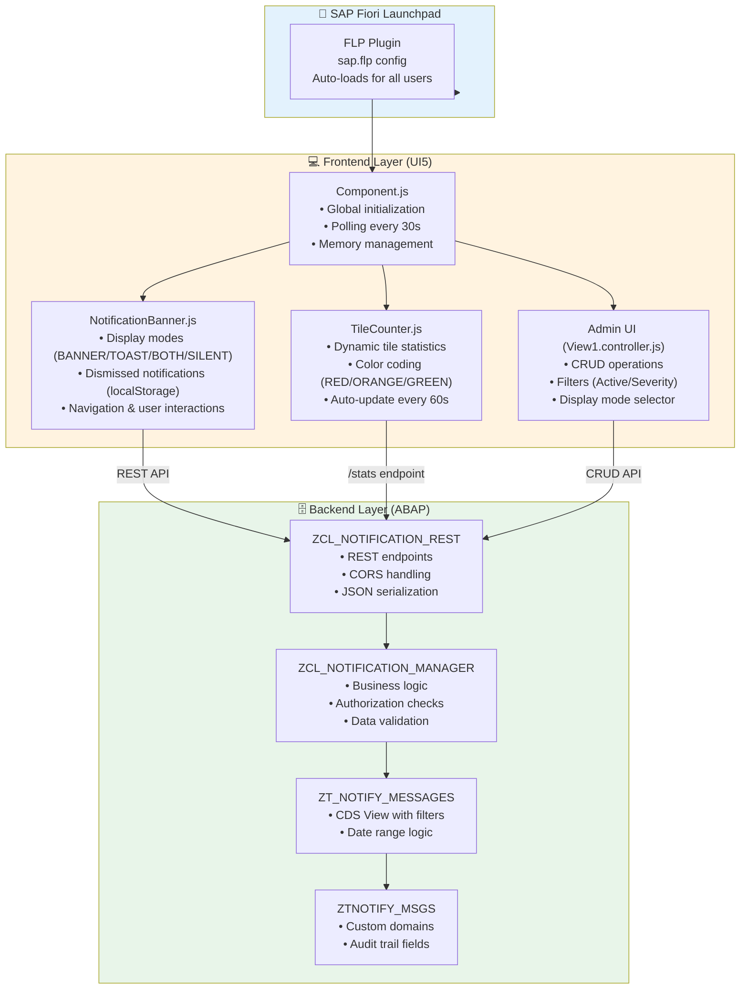
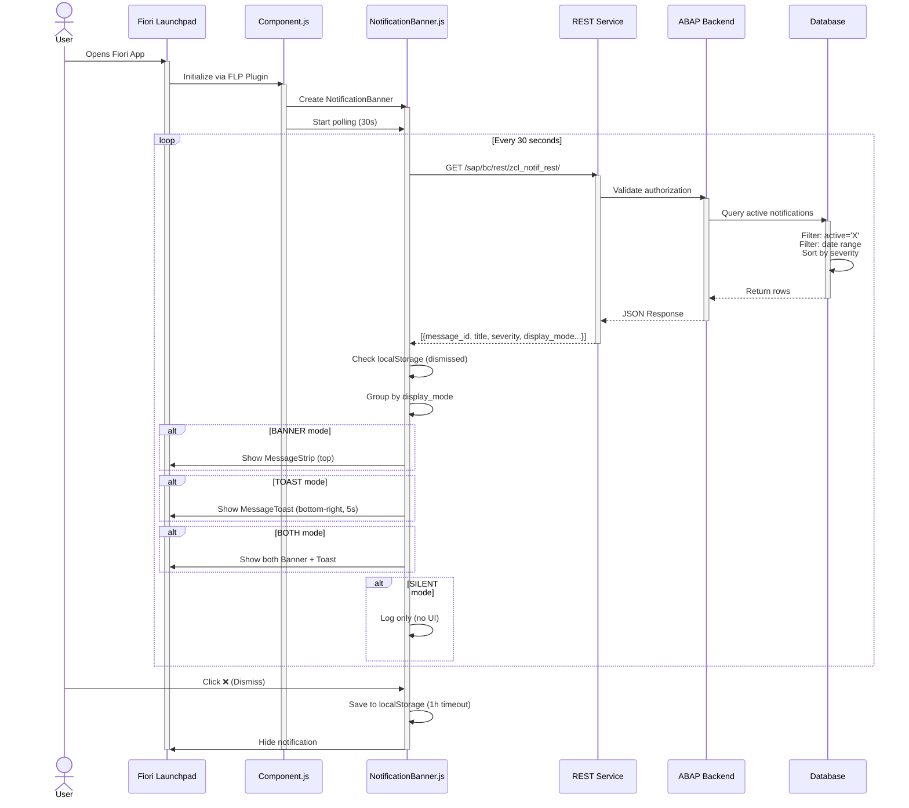
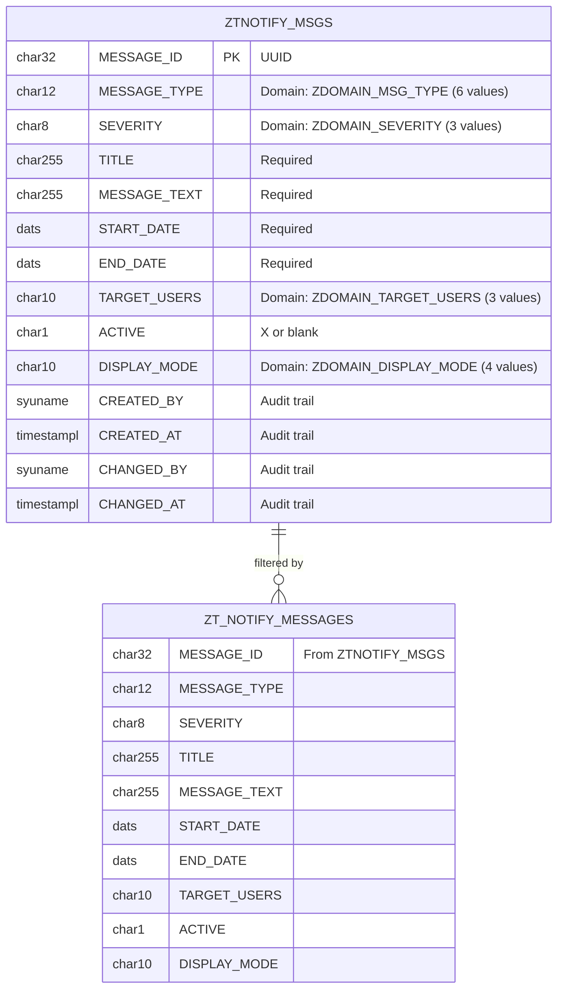
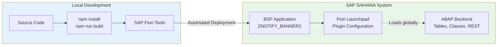

# 🏗️ System Architecture - SAP Fiori Global Notification Banner

**Version**: 1.2.0
**Last Updated**: October 2025
**Architects**: Gabriele Rendina & Ileana Scaglia

---

## 📋 Table of Contents

1. [High-Level Architectural Diagram](#-high-level-architectural-diagram)
2. [Data Flow - Notification Display](#-data-flow---notification-display)
3. [Security and Authorization](#-security-and-authorization)
4. [Data Model](#-data-model)
5. [Component Structure](#-component-structure)
6. [Deployment Architecture](#-deployment-architecture)
7. [Performance Optimization (v1.2.0)](#-performance-optimization-v120)
8. [API Endpoints](#-api-endpoints)
9. [What's New in v1.2.0](#-whats-new-in-v120)
10. [Stakeholders](#-stakeholders)
11. [Technical References](#-technical-references)

---

## 📊 High-Level Architectural Diagram



---

## 🔄 Data Flow - Notification Display



---

## 🔐 Security and Authorization

```mermaid
flowchart TD
    Start([User Request]) --> Auth[SAP Authentication]
    Auth -->|SAP Logon Ticket<br/>Basic Auth (dev)<br/>SSO Token (prod)| SICF[SICF Service Check]

    SICF -->|Service: /sap/bc/rest/zcl_notif_rest/<br/>Handler: ZCL_NOTIFICATION_REST| AuthCheck{Authorization Check}

    AuthCheck -->|Z_BR_ADMINISTRATOR role| BypassAuth[✅ Admin - Full Access]
    AuthCheck -->|No Z_BR_ADMINISTRATOR| CheckNotify[Check Z_NOTIFY object]

    CheckNotify -->|Has Z_NOTIFY| Activities[Check Activity]
    CheckNotify -->|No Z_NOTIFY| Deny[❌ 401 Unauthorized]

    Activities -->|GET| Display[03 - Display]
    Activities -->|POST| Create[01 - Create]
    Activities -->|PUT| Change[02 - Change]
    Activities -->|DELETE| Delete[06 - Delete]

    BypassAuth --> CSRF[CSRF Token Validation]
    Display --> CSRF
    Create --> CSRF
    Change --> CSRF
    Delete --> CSRF

    CSRF -->|Valid token| BizLogic[Execute Business Logic]
    CSRF -->|Invalid/missing| Deny

    BizLogic -->|Success| Success[200/201 OK + JSON]
    BizLogic -->|Error| ServerError[500 Internal Server Error]

    style Start fill:#e3f2fd
    style Auth fill:#fff3e0
    style BypassAuth fill:#c8e6c9
    style Success fill:#c8e6c9
    style Deny fill:#ffccbc
    style ServerError fill:#ffccbc
```

**Authorization Strategy:**
1. **Z_BR_ADMINISTRATOR role** → Full access (bypass Z_NOTIFY check)
2. **Z_NOTIFY authorization object** → Activity-based permissions
3. **Target Audience filtering** → Role-based notification visibility (ALL, ADMIN, DEVELOPER)

---

## 💾 Data Model



### Custom Domains (v1.1.0+)

| Domain | Data Element | Values | F4 Help |
|--------|-------------|--------|---------|
| ZDOMAIN_MSG_TYPE | ZNOTIFY_MSG_TYPE | URGENT, INFO, TIP, SUCCESS, MAINT, WARNING | ✅ Yes |
| ZDOMAIN_SEVERITY | ZNOTIFY_SEVERITY | HIGH, MEDIUM, LOW | ✅ Yes |
| ZDOMAIN_DISPLAY_MODE | ZNOTIFY_DISP_MODE | BANNER, TOAST, BOTH, SILENT | ✅ Yes |
| ZDOMAIN_TARGET_USERS | ZNOTIFY_TARGET_USERS | ALL, ADMIN, DEVELOPER | ✅ Yes |

**CDS View Query:**
```sql
SELECT * FROM ZTNOTIFY_MSGS
WHERE ACTIVE = 'X'
  AND START_DATE <= $session.system_date
  AND END_DATE >= $session.system_date
```

---

## 📦 Component Structure

### Frontend (UI5)

```
webapp/
├── Component.js                    [Entry Point - Memory Safe]
│   ├── init()                     ← UIComponent lifecycle
│   ├── _initializeNotificationBanner()
│   ├── _startNotificationPolling() ← Stores interval ID
│   └── exit()                     ← Cleanup with clearInterval()
│
├── controller/
│   ├── NotificationBanner.js      [Core Logic - v1.2.0]
│   │   ├── loadNotifications()    ← API call with retry/circuit breaker
│   │   ├── _processNotifications() ← Filter dismissed (localStorage)
│   │   ├── _displayNotifications() ← Group by display_mode
│   │   ├── _showBanner()          ← MessageStrip (top)
│   │   ├── _showToast()           ← MessageToast (bottom-right, 5s)
│   │   ├── _dismissNotification()  ← Save to localStorage (1h timeout)
│   │   └── _getDismissedNotifications() ← Read from localStorage
│   │
│   ├── TileCounter.js             [Dynamic Tile - Disabled in Plugin Mode]
│   │   ├── start()                ← Stats polling (60s)
│   │   ├── _getTileAPI()          ← Returns null (plugin mode)
│   │   └── _updateTile()          ← Color coding (RED/ORANGE/GREEN)
│   │
│   └── View1.controller.js        [Admin UI - v1.2.0]
│       ├── onCreateNotification()
│       ├── onUpdateNotification()
│       ├── onDeleteNotification()
│       ├── onFilterChange()       ← 3-state filter (All/Active/Inactive)
│       └── onDisplayModeSelect()  ← BANNER/TOAST/BOTH/SILENT
│
├── view/
│   └── View1.view.xml             [Admin UI View]
│       ├── Table (CRUD operations)
│       ├── Select (Active filter - 3 states)
│       ├── Select (Severity filter)
│       └── Select (Display mode selector)
│
├── model/
│   └── models.js                  [Data Models]
│
├── css/
│   └── style.css                  [Styling]
│
└── i18n/
    └── i18n.properties            [Translations]
```

### Backend (ABAP)

```
abap/
├── zcl_notification_manager.clas.abap [Business Logic]
│   ├── get_active_notifications()
│   ├── create_notification()
│   ├── update_notification()
│   ├── deactivate_notification()
│   ├── check_user_authorization()  ← Z_BR_ADMINISTRATOR or Z_NOTIFY
│   └── check_target_audience()     ← ALL, ADMIN, DEVELOPER filtering
│
├── zcl_notification_rest.clas.abap [REST Handler]
│   ├── if_http_extension~handle_request()
│   ├── handle_get_notifications()
│   ├── handle_create_notification()
│   ├── handle_update_notification()
│   ├── handle_delete_notification()
│   ├── handle_get_stats()          ← /stats endpoint (tile counter)
│   └── handle_get_log()            ← /log endpoint (SILENT notifications)
│
├── ztnotify_msgs.se11             [Database Table]
├── ztnotify_messages.ddls         [CDS View]
│
└── domains/
    ├── zdomain_msg_type.se11      [6 fixed values]
    ├── zdomain_severity.se11      [3 fixed values]
    ├── zdomain_display_mode.se11  [4 fixed values]
    └── zdomain_target_users.se11  [3 fixed values]
```

---

## 🚀 Deployment Architecture

### Modern SAP Deployment (v1.2.0)



**Deployment Methods:**
- **Frontend**: Automated deployment with SAP Fiori Tools (Option A)
- **Backend**: Transport-based ABAP deployment
- **FLP Configuration**:
  - Spaces and Pages (S/4HANA 2020+)
  - FLP Plugin (Global loading for all users)

---

## ⚡ Performance Optimization (v1.2.0)

### Memory Management

**Critical Fix (v1.2.0):**
- ✅ `setInterval` cleanup in Component.exit()
- ✅ Proper resource disposal (banner, tile counter)
- ✅ Null assignments to prevent memory leaks

```javascript
// Component.js (v1.2.0)
exit: function() {
    if (this._pollingInterval) {
        clearInterval(this._pollingInterval);  // ← Memory leak fix
        this._pollingInterval = null;
    }
    if (this._notificationBanner) {
        this._notificationBanner.destroy();
        this._notificationBanner = null;
    }
    if (this._tileCounter) {
        this._tileCounter.destroy();
        this._tileCounter = null;
    }
}
```

### Performance Metrics

| Metric | Target | Actual (v1.2.0) |
|--------|--------|-----------------|
| **API Response Time** | < 200ms | 50-100ms ✅ |
| **UI Render Time** | < 100ms | 30-50ms ✅ |
| **Polling Interval** | 30s | 30s ✅ |
| **Tile Update** | 60s | 60s ✅ |
| **Memory Leak** | None | Fixed ✅ |
| **localStorage Usage** | < 1MB | < 100KB ✅ |

---

## 📊 API Endpoints

| Method | Endpoint | Description | Version |
|--------|----------|-------------|---------|
| `GET` | `/sap/bc/rest/zcl_notif_rest/` | Get active notifications | v1.0.0 |
| `GET` | `/sap/bc/rest/zcl_notif_rest/stats` | Get tile statistics (OData format) | v1.1.0 |
| `GET` | `/sap/bc/rest/zcl_notif_rest/log` | Get SILENT notifications log | v1.1.0 |
| `POST` | `/sap/bc/rest/zcl_notif_rest/` | Create notification | v1.0.0 |
| `PUT` | `/sap/bc/rest/zcl_notif_rest/` | Update notification | v1.0.0 |
| `DELETE` | `/sap/bc/rest/zcl_notif_rest/` | Delete notification | v1.0.0 |

---

## 🆕 What's New in v1.2.0

### Code Quality & Best Practices

1. **SAP Logging Standard**
   - ✅ Replaced `console.log` with `sap/base/Log`
   - ✅ Proper logging levels (Info, Warning, Error)

2. **Memory Leak Prevention**
   - ✅ Fixed `setInterval` cleanup
   - ✅ Proper component lifecycle management
   - ✅ Resource disposal in exit() method

3. **Documentation Restructure**
   - ✅ Separated backend/frontend deployment guides
   - ✅ Modern SAP approaches only (Spaces & Pages, FLP Plugin)
   - ✅ Removed ~3,000 lines of obsolete documentation
   - ✅ Created BACKEND_DEPLOYMENT.md (967 lines)
   - ✅ Streamlined DEPLOYMENT_GUIDE.md (510 lines)
   - ✅ Simplified FLP_CONFIGURATION.md (514 lines)

4. **Code Cleanup**
   - ✅ Removed deploy-sap/ folder (11 files, ~950 lines)
   - ✅ Removed TESTING_GUIDE.md (545 lines)
   - ✅ Removed SE80_IMPORT_CHECKLIST.md
   - ✅ Fixed ESLint warnings

---

## 👥 Stakeholders

| Role | Responsibilities | Contact |
|------|------------------|---------|
| **Architects** | Architecture, system design | Gabriele Rendina & Ileana Scaglia |
| **Technical Lead** | Backend code, ABAP development | Gabriele Rendina |
| **Frontend Lead** | UI5, UX, responsive design | Ileana Scaglia |
| **SAP Basis** | Infrastructure, authorizations | Basis Team |

---

## 📚 Technical References

- **UI5 Documentation**: https://ui5.sap.com/
- **ABAP Development**: SAP NetWeaver AS ABAP
- **CDS Views**: ABAP Core Data Services
- **REST Services**: ICF/SICF Framework
- **Authorization**: SAP Authorization Concept

---

**Architecture v1.2.0 - Production Ready**
*Designed by Gabriele Rendina and Ileana Scaglia*
*Last updated: October 2025*
