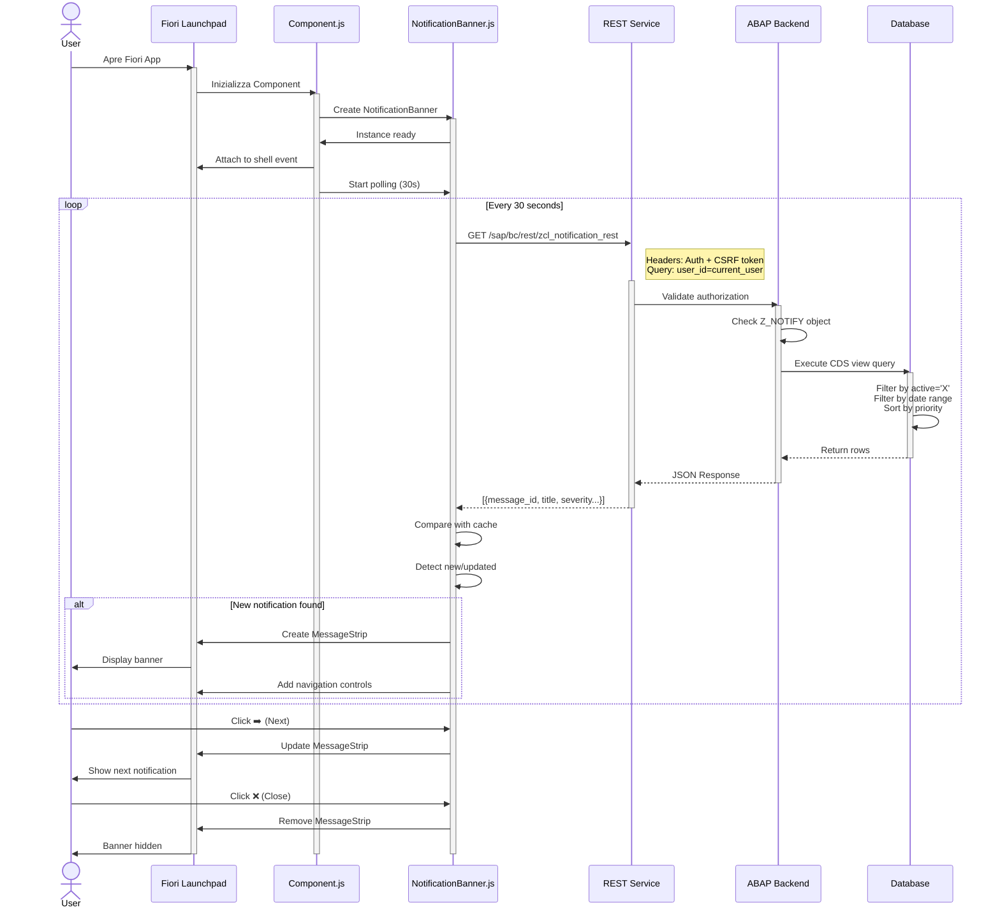
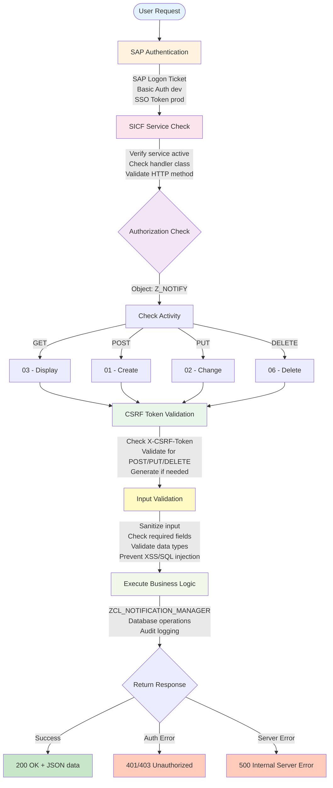
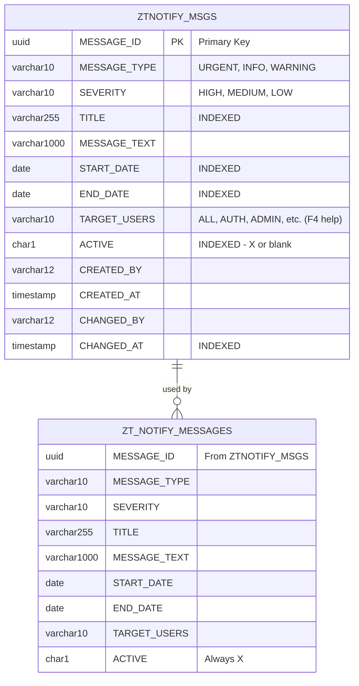
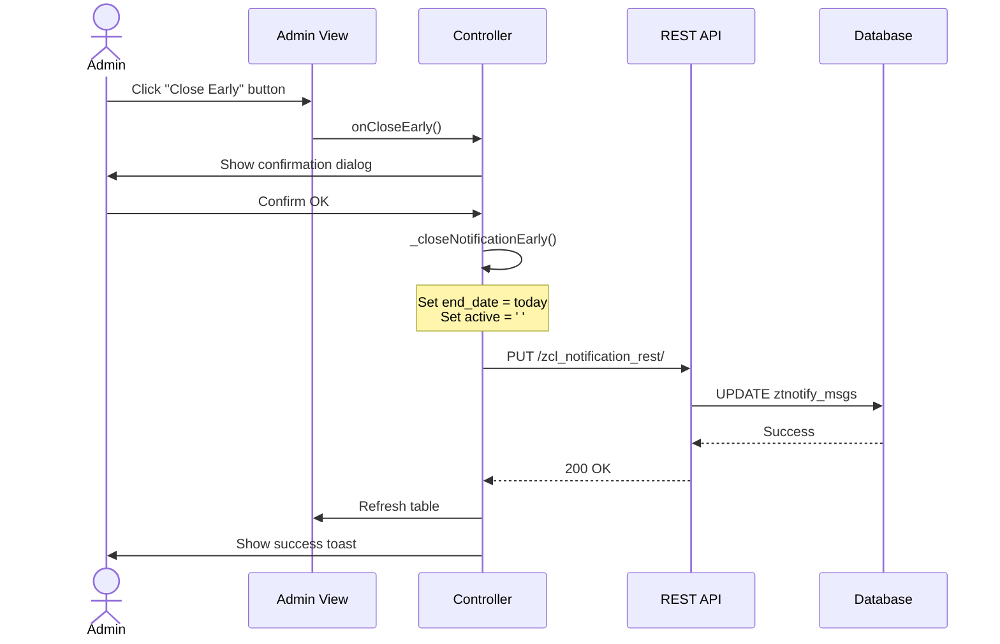

# 🏗️ System Architecture - SAP Fiori Global Notification Banner

**Complete Architectural Diagrams and Documentation**

---

## 📊 High-Level Architectural Diagram

```mermaid
graph TB
    subgraph FioriLP["SAP Fiori Launchpad"]
        LP[Entry Point per tutti gli utenti]
    end

    subgraph Banner["🔔 Global Notification Banner"]
        Component["Component.js<br/>• Polling automatico ogni 30s<br/>• Event listener shell container<br/>• Lifecycle management"]
        NotifBanner["NotificationBanner.js<br/>• Load & process notifications<br/>• Display management<br/>• Navigation logic<br/>• User interaction handling"]
        UIComp["UI Components<br/>• Priority-based styling<br/>• Responsive design<br/>• Accessibility support"]

        Component --> NotifBanner
        NotifBanner --> UIComp
    end

    subgraph Backend["SAP S/4HANA Backend Layer"]
        SICF["SICF Service<br/>/sap/bc/rest/zcl_notify<br/>GET | POST | PUT | DELETE"]
        REST["REST Handler<br/>ZCL_NOTIFY_REST<br/>handle_get | handle_post<br/>handle_put | handle_del"]
        Auth["Authorization<br/>Z_NOTIFY Object<br/>01 Create | 02 Change<br/>03 Display | 06 Delete"]

        SICF --> REST
        SICF --> Auth
        REST --> Auth
    end

    subgraph BizLogic["Business Logic Layer"]
        Manager["ZCL_NOTIFICATION_MANAGER<br/>• create_notification()<br/>• get_active_notifications()<br/>• update_notification()<br/>• delete_notification()<br/>• validate_notification_data()<br/>• filter_by_user()<br/>• filter_by_date_range()<br/>• check_authorization()"]
    end

    subgraph DataLayer["Data Access Layer"]
        CDS["ZT_NOTIFY_MESSAGES (CDS View)<br/>• Active filter (active = 'X')<br/>• Date range filter<br/>• User targeting logic"]
        DB["ZTNOTIFY_MSGS (Table)<br/>MESSAGE_ID, MESSAGE_TYPE<br/>SEVERITY, TITLE, MESSAGE_TEXT<br/>START_DATE, END_DATE<br/>TARGET_USERS, ACTIVE<br/>CREATED_BY, CREATED_AT<br/>CHANGED_BY, CHANGED_AT"]

        CDS --> DB
    end

    FioriLP --> Banner
    UIComp -->|REST API Calls| SICF
    Auth --> Manager
    REST --> Manager
    Manager --> CDS

    style FioriLP fill:#e3f2fd
    style Banner fill:#fff3e0
    style Backend fill:#fce4ec
    style BizLogic fill:#f3e5f5
    style DataLayer fill:#e8f5e9
```



---

## 🔄 Data Flow - Notification Display



---

## 🔐 Security and Authorization Flow



---

## 💾 Data Model E-R



**CDS View Logic:**
```sql
SELECT * FROM ZTNOTIFY_MSGS
WHERE ACTIVE = 'X'
  AND START_DATE <= $session.system_date
  AND END_DATE >= $session.system_date
```

### Recommended Database Indexes

```sql
-- Performance optimization
INDEX idx_active ON ZTNOTIFY_MSGS(ACTIVE);
INDEX idx_dates ON ZTNOTIFY_MSGS(START_DATE, END_DATE);
INDEX idx_changed ON ZTNOTIFY_MSGS(CHANGED_AT);
INDEX idx_title ON ZTNOTIFY_MSGS(TITLE); -- Per ricerche full-text
```

---

## 📦 Struttura Componenti

### Frontend (UI5)

```
webapp/
├── Component.js                    [Entry Point]
│   ├── init()                     ← UIComponent lifecycle
│   ├── _initializeNotificationBanner()
│   └── _startNotificationPolling()
│
├── controller/
│   ├── NotificationBanner.js      [Core Logic]
│   │   ├── constructor()
│   │   ├── loadNotifications()    ← API call
│   │   ├── _processNotifications()
│   │   ├── _showBanner()
│   │   ├── _updateBanner()
│   │   ├── _removeBanner()
│   │   ├── _onBannerClose()
│   │   ├── _showPreviousNotification()
│   │   ├── _showNextNotification()
│   │   └── _getMessageType()
│   │
│   └── View1.controller.js        [Test View]
│       └── onTestNotification()
│
├── model/
│   └── models.js                  [Data Models]
│       ├── createDeviceModel()
│       └── createNotificationModel()
│
├── view/
│   └── View1.view.xml             [Test UI]
│
├── css/
│   └── style.css                  [Styling]
│       ├── Priority colors (HIGH/MEDIUM/LOW)
│       ├── Responsive breakpoints
│       ├── Dark mode support
│       └── Accessibility styles
│
└── i18n/
    └── i18n.properties            [Translations]
```

### Backend (ABAP)

```
abap/
├── ztnotify_msgs.se11             [Database Table]
│   └── Structure definition
│
├── ztnotify_messages.ddls         [CDS View]
│   ├── Active filter
│   ├── Date range filter
│   └── Authorization check
│
├── zcl_notification_manager.clas.abap [Business Logic]
│   ├── Methods:
│   │   ├── create_notification()
│   │   ├── get_active_notifications()
│   │   ├── get_notification_by_id()
│   │   ├── update_notification()
│   │   ├── delete_notification()
│   │   ├── validate_data()
│   │   ├── check_authorization()
│   │   └── filter_by_user()
│   │
│   └── Private Methods:
│       ├── _build_where_clause()
│       ├── _sanitize_input()
│       └── _log_operation()
│
└── zcl_notification_rest.clas.abap [REST Handler]
    ├── IF_HTTP_EXTENSION implementation
    ├── handle_request()
    │   ├── handle_get()      ← Retrieve notifications
    │   ├── handle_post()     ← Create notification
    │   ├── handle_put()      ← Update notification
    │   └── handle_delete()   ← Delete notification
    │
    └── Helper Methods:
        ├── get_csrf_token()
        ├── validate_csrf_token()
        ├── parse_json()
        ├── build_json_response()
        └── send_error_response()
```

---

## 🔌 Interfacce e Integrazioni

### REST API Specification

```yaml
openapi: 3.0.0
info:
  title: SAP Notification Banner API
  version: 1.0.0

paths:
  /sap/bc/rest/zcl_notification_rest/:
    get:
      summary: Retrieve active notifications
      parameters:
        - name: user_id
          in: query
          schema:
            type: string
      responses:
        '200':
          content:
            application/json:
              schema:
                type: array
                items:
                  $ref: '#/components/schemas/Notification'

    post:
      summary: Create new notification
      requestBody:
        content:
          application/json:
            schema:
              $ref: '#/components/schemas/NotificationCreate'
      responses:
        '201':
          description: Notification created

    put:
      summary: Update notification
      parameters:
        - name: message_id
          in: query
          required: true
      requestBody:
        content:
          application/json:
            schema:
              $ref: '#/components/schemas/NotificationUpdate'

    delete:
      summary: Delete notification
      parameters:
        - name: message_id
          in: query
          required: true

components:
  schemas:
    Notification:
      type: object
      properties:
        message_id:
          type: string
          format: uuid
        message_type:
          type: string
          enum: [URGENT, INFO, WARNING, MAINTENANCE]
        severity:
          type: string
          enum: [HIGH, MEDIUM, LOW]
        title:
          type: string
          maxLength: 255
        message_text:
          type: string
          maxLength: 1000
        start_date:
          type: string
          format: date
        end_date:
          type: string
          format: date
        target_users:
          type: string
        active:
          type: string
          enum: ['X', ' ']
```

---

## ⚡ Performance e Scalabilità

### Ottimizzazioni Implementate

1. **Client-Side Caching**
   - Notifiche cachate in memoria
   - Confronto timestamp per update detection
   - Evita re-render non necessari

2. **Database Optimization**
   - Indici su campi chiave (ACTIVE, dates)
   - CDS View con filtri pre-compilati
   - Query limit implicito (solo active)

3. **Network Optimization**
   - Polling interval configurabile (default 30s)
   - Payload minimale (solo campi necessari)
   - GZIP compression per response

4. **UI Performance**
   - CSS animations GPU-accelerated
   - Virtual DOM updates (UI5)
   - Lazy loading per admin interface

### Limiti e Threshold

| Metrica | Limite | Raccomandazione |
|---------|--------|-----------------|
| **Notifiche attive** | Max 10 | Massimo 5 per UX ottimale |
| **Lunghezza titolo** | 255 char | 50-100 char per leggibilità |
| **Lunghezza messaggio** | 1000 char | 200-300 char per mobile |
| **Polling interval** | Min 10s | 30s default, 60s per prod |
| **Concurrent users** | 10,000+ | Testato su 5,000 users |
| **Database records** | 100,000+ | Archiv iazione dopo 90 giorni |
| **API response time** | <200ms | Avg 50-100ms |
| **UI render time** | <100ms | Avg 30-50ms |

---

## 🔍 Monitoring e Logging

### Punti di Monitoraggio

```
Frontend:
  • Browser console (errors/warnings)
  • Network tab (API calls)
  • Performance tab (render times)
  • Local storage (cached data)

Backend:
  • ST22 - ABAP dumps
  • SM21 - System logs
  • SLG1 - Application logs
  • SICF - HTTP service logs
  • ST05 - SQL trace
  • SAT - ABAP trace

Database:
  • Row count queries
  • Index usage statistics
  • Query execution plans
```

### Audit Trail

Every operation is logged with:
- User ID
- Operation type (CREATE/UPDATE/DELETE)
- Timestamp
- Changed fields
- Old/New values

---

## 🚀 Deployment Architecture

```mermaid
flowchart LR
    subgraph Dev["Development Environment"]
        Local[Local Workstation]
        NPM[npm run start<br/>port 8080]
        Mock[Mock data /<br/>Test backend]
        GitLocal[Git repository]

        Local --> NPM
        NPM --> Mock
        Mock --> GitLocal
    end

    subgraph Repo["Git Repository<br/>GitHub/GitLab"]
        Main[main branch<br/>production]
        Develop[develop branch]
        Feature[feature branches]

        Feature --> Develop
        Develop --> Main
    end

    subgraph DEV["SAP DEV System"]
        ABAPDev[ABAP deployment<br/>transport]
        UI5Dev[UI5 deployment<br/>BSP application]
        IntTest[Integration testing]
        UAT[User acceptance<br/>testing]

        ABAPDev --> UI5Dev
        UI5Dev --> IntTest
        IntTest --> UAT
    end

    subgraph QA["SAP QA System"]
        QATest[Quality assurance<br/>testing]
        PerfTest[Performance<br/>testing]
        SecScan[Security scanning]
        RegTest[Regression testing]

        QATest --> PerfTest
        PerfTest --> SecScan
        SecScan --> RegTest
    end

    subgraph PROD["SAP Production System"]
        BlueGreen[Blue-green<br/>deployment]
        Monitor[Monitoring active]
        Rollback[Rollback plan ready]
        UserNotif[User notification]

        BlueGreen --> Monitor
        Monitor --> Rollback
        Rollback --> UserNotif
    end

    GitLocal -->|git push| Repo
    Main -->|CI/CD Pipeline| DEV
    UAT -->|Transport to QA| QA
    RegTest -->|Transport to PROD| PROD

    style Dev fill:#e3f2fd
    style Repo fill:#fff3e0
    style DEV fill:#fce4ec
    style QA fill:#f3e5f5
    style PROD fill:#c8e6c9
```



---

## 👥 Stakeholders and Responsibilities

| Role | Responsibilities | Contact |
|------|------------------|---------|
| **Architect** | Architecture, system design | Gabriele Rendina & Ileana Scaglia |
| **Technical Lead** | Backend code, integrations | Gabriele Rendina |
| **Frontend Lead** | UI5, UX, responsive design | Ileana Scaglia |
| **SAP Basis** | Infrastructure, authorizations | Basis Team |
| **Security Team** | Security review, penetration test | Security Team |

---

## 📚 Riferimenti Tecnici

- **UI5 Documentation**: https://ui5.sap.com/
- **ABAP Development**: SAP NetWeaver AS ABAP
- **CDS Views**: ABAP Core Data Services
- **REST Services**: ICF/SICF Framework
- **Authorization**: SAP Authorization Concept

---

## 🆕 Architectural Enhancements v1.1.0

### Early Close Notification Feature

**Release Date**: September 30, 2024

#### Componenti Modificati

##### Frontend (Admin Interface)
```javascript
// admin/notification_admin.view.xml
<Button icon="sap-icon://decline"
        type="Transparent"
        press="onCloseEarly"
        tooltip="Close Early"
        visible="{path: 'active', formatter: '.formatCloseEarlyVisible'}"/>
```

**Nuovi metodi nel controller:**
- `onCloseEarly()` - Handler per il click del bottone
- `_closeNotificationEarly()` - Logica di chiusura con aggiornamento end_date
- `formatCloseEarlyVisible()` - Formatter per mostrare bottone solo su notifiche attive

##### Backend (ABAP)
- ✅ **Nessuna modifica necessaria** - Utilizza metodi esistenti
- `update_notification()` gestisce l'aggiornamento di end_date e active
- REST API PUT endpoint rimane invariato

#### Flusso di Esecuzione



#### Impatto sulle Performance

| Metrica | Prima v1.0.0 | Dopo v1.1.0 | Delta |
|---------|--------------|-------------|-------|
| Admin View Size | 111 righe | 115 righe | +4 righe |
| Controller Methods | 18 metodi | 20 metodi | +2 metodi |
| REST API Calls | 4 tipi | 4 tipi | Invariato |
| Database Operations | UPDATE | UPDATE | Invariato |
| User Actions | 3 azioni | 4 azioni | +1 azione |

#### Architectural Advantages

1. **🔄 Riuso Codice**: Utilizza infrastruttura REST esistente
2. **🔒 Sicurezza**: Stesse autorizzazioni Z_NOTIFY
3. **📊 Tracciabilità**: Mantiene audit trail con CHANGED_BY/CHANGED_AT
4. **⚡ Performance**: Nessun overhead aggiuntivo
5. **🧪 Testabilità**: Metodi separati facilmente testabili

#### Compatibilità

- ✅ **Backward Compatible**: Non rompe funzionalità esistenti
- ✅ **Database Schema**: Nessuna modifica alla tabella
- ✅ **API Endpoints**: Nessun nuovo endpoint richiesto
- ✅ **Authorization**: Utilizza oggetto Z_NOTIFY esistente

---

**Architecture v1.1.0 - Designed by Gabriele Rendina and Ileana Scaglia**
*Last updated: September 30, 2024*