# 🚀 Complete Deployment Guide - SAP Fiori Global Notification Banner

**Version**: 1.1.1
**Last Updated**: January 2025

---

## 🆕 Latest Updates (v1.1.1)

**Application Name Changed**: `ZNOTIFY_BANNER` → `ZNOTIFY_BANNER2`
**Namespace**: `com.sap.notifications.banner2`

**Critical Fixes Applied**:
- ✅ Page height CSS issue resolved (inline styles added)
- ✅ Mockserver error handling fixed (graceful fallback)
- ✅ BSP structure confirmed correct per SAP official documentation

📄 **See**: [`docs/RELEASE_NOTES.md`](./RELEASE_NOTES.md) for complete change log.

---

## 🏗️ Architecture: Single App Design

**CRITICAL**: This solution uses **ONE SINGLE SAP Fiori Application** (`ZNOTIFY_BANNER2`) with dual functionality:

1. **Admin Interface** (Visible Dynamic Tile):
   - CRUD operations for notification management
   - Visible only to admin users (role: `Z_NOTIF_ADMIN` or `SAP_ALL`)
   - One dynamic tile showing live statistics

2. **Global Notification Banner** (Background Component):
   - Displays notifications to ALL users in Fiori Launchpad
   - Loads automatically via hidden tile or FLP plugin configuration
   - No separate application or tile needed

**Key Points**:
- ✅ **Single BSP Application**: ZNOTIFY_BANNER2
- ✅ **Single Dynamic Tile**: "System Notifications" (for admins only)
- ✅ **No multiple apps**: Admin UI + Global Banner are in ONE app
- ✅ **Deployment**: Deploy once, configure FLP for admin tile + global banner activation

---

## 📋 Table of Contents
1. [Pre-Deployment Verification](#pre-deployment-verification)
2. [Prerequisites](#prerequisites)
3. [System Requirements](#system-requirements)
4. [Backend Deployment (ABAP)](#backend-deployment-abap)
   - [Step 1: Create Custom Domains](#step-1-create-custom-domains)
   - [Step 2: Create Data Elements](#step-2-create-data-elements)
   - [Step 3: Create Database Table](#step-3-create-database-table)
   - [Step 4: Create CDS View](#step-4-create-cds-view)
   - [Step 5: Create ABAP Classes](#step-5-create-abap-classes)
   - [Step 6: Configure REST Service](#step-6-configure-rest-service)
   - [Step 7: Create Authorization Object (Optional)](#step-7-create-authorization-object-optional)
5. [Frontend Deployment (UI5)](#frontend-deployment-ui5)
6. [Fiori Launchpad Configuration](#fiori-launchpad-configuration)
7. [Testing](#testing)
8. [Troubleshooting](#troubleshooting)
9. [Maintenance](#maintenance)

---

## ✅ Pre-Deployment Verification

Before starting the deployment process, verify that the project is ready for production.

### Build Verification
Run the following commands to ensure the build process works correctly:

⚠️ **IMPORTANT**: Use `build:sap` for SAP BSP deployment (not `build`)

```bash
# Build SAP-compatible deployment package
npm run build:sap

# Verify output folders
ls -lh deploy-sap/
# Expected: 10 files (no hyphens in names)

ls deploy-sap/controller/
# Expected: 3 files (NotificationBanner.js, TileCounter.js, View1.controller.js)
```

**Expected Results:**
- ✅ Build completes in ~20-30 seconds without errors
- ✅ `deploy-sap/` folder created with 10 SAP-compatible files
- ✅ No files with hyphens (`-`) in filenames
- ✅ All critical files present (Component.js, index.html, manifest.json, etc.)

### Code Quality Verification

**ABAP Files:**
- ✅ `abap/domains/` - 4 custom domains with fixed values
- ✅ `abap/data_elements/` - 4 data elements for type safety
- ✅ `abap/ztnotify_msgs.se11` - Table definition with custom data elements
- ✅ `abap/ztnotify_messages.ddls` - CDS view syntax valid
- ✅ `abap/zcl_notification_manager.clas.abap` - Business logic class
- ✅ `abap/zcl_notification_rest.clas.abap` - REST service class

**Frontend Files:**
- ✅ `webapp/Component.js` - FLP compatibility with safe checks
- ✅ `webapp/controller/NotificationBanner.js` - Banner and toast display logic
- ✅ `webapp/controller/TileCounter.js` - Dynamic tile counter
- ✅ `webapp/manifest.json` - Valid JSON with correct dataSources
- ✅ `webapp/i18n/i18n.properties` - 90+ translation keys
- ✅ `ui5.yaml` - Build configuration with zipper task

### Production Readiness Features

Verify these features are implemented:

- ✅ **Display Modes**: BANNER, TOAST, BOTH, SILENT support
- ✅ **Tile Counter**: Real-time statistics with color coding
- ✅ **Error Handling**: Exponential backoff retry (3 attempts: 1s → 2s → 4s delays)
- ✅ **Circuit Breaker**: Opens after 5 consecutive errors, resets after 60s
- ✅ **FLP Compatibility**: Safe checks for `sap.ushell.Container` existence
- ✅ **Standalone Mode**: Works in both FLP and standalone environments
- ✅ **Timeout Handling**: 10s AJAX timeout configured
- ✅ **User Context**: Safe user ID retrieval with ANONYMOUS fallback

### GO/NO-GO Decision

**✅ GO - Ready for Production** if:
- All build verification steps pass
- All ABAP files have correct syntax
- Frontend files validated
- Error handling features confirmed

**❌ NO-GO - Fix Issues** if:
- Build fails or produces errors
- ABAP syntax errors exist
- Missing Component-preload.js
- manifest.json validation fails

---

## 📊 Deployment Overview

```mermaid
graph TB
    Start([🚀 Start Deployment]) --> Prerequisites{Prerequisites<br/>Met?}
    Prerequisites -->|No| SetupEnv[Setup Environment<br/>Install Node.js, UI5 Tools<br/>Get SAP Access]
    SetupEnv --> Prerequisites
    Prerequisites -->|Yes| Backend[🗄️ Backend Deployment]

    Backend --> Domains[Step 1: Custom Domains<br/>SE11: Create 4 Domains]
    Domains --> DataElements[Step 2: Data Elements<br/>SE11: Create 4 Data Elements]
    DataElements --> DB[Step 3: Database Table<br/>SE11: ZTNOTIFY_MSGS]
    DB --> CDS[Step 4: CDS View<br/>SE80: ZTNOTIFY_MESSAGES]
    CDS --> Classes[Step 5: ABAP Classes<br/>SE80: Manager + REST]
    Classes --> REST[Step 6: REST Service<br/>SICF: Configure endpoint]
    REST --> Auth[Step 7: Authorization<br/>SU21/PFCG: Optional]

    Auth --> Frontend[💻 Frontend Deployment]
    Frontend --> Install[Install Dependencies<br/>npm install]
    Install --> Configure[Configure<br/>ui5.yaml, manifest.json]
    Configure --> Build[Build<br/>npm run build]
    Build --> Deploy[Deploy to SAP<br/>BSP Application]
    Deploy --> FLP[FLP Configuration<br/>/UI2/FLPD_CUST]

    FLP --> Testing[🧪 Testing Phase]
    Testing --> DisplayModes[Test Display Modes<br/>BANNER/TOAST/BOTH/SILENT]
    Testing --> TileCounter[Test Tile Counter<br/>Statistics/Color Coding]
    Testing --> BackendTest[Backend Tests<br/>REST API/Database]

    DisplayModes --> Verification{All Tests<br/>Pass?}
    TileCounter --> Verification
    BackendTest --> Verification
    Verification -->|No| Debug[🔧 Troubleshooting]
    Debug --> Testing
    Verification -->|Yes| Production[✅ Production Ready]

    Production --> Monitor[📊 Monitoring & Maintenance]

    style Start fill:#c8e6c9,stroke:#388e3c,stroke-width:2px
    style Backend fill:#bbdefb,stroke:#1976d2,stroke-width:2px
    style Frontend fill:#ffccbc,stroke:#d84315,stroke-width:2px
    style Testing fill:#fff9c4,stroke:#f57c00,stroke-width:2px
    style Production fill:#c8e6c9,stroke:#388e3c,stroke-width:3px
    style Verification fill:#ffecb3,stroke:#f57c00,stroke-width:2px
```



**Estimated Total Time**: 4-6 hours for experienced SAP developers

---

## 🔧 Prerequisites

### System Access Required
- ✅ **ABAP Development** access (SE11, SE80, SICF)
- ✅ **Authorization Management** access (SU01, PFCG, SU21)
- ✅ **Fiori Launchpad** configuration access
- ✅ **Node.js** environment (v16+ recommended)
- ✅ **UI5 Tooling** setup

### Required Knowledge
- SAP ABAP development
- UI5/Fiori development basics
- SAP authorization concepts
- REST API configuration

---

## 🖥️ System Requirements

### Backend (S/4HANA)
- **Version**: S/4HANA PCE 2023 or higher
- **Components**: SAP_UI, SAP_GWFND, SAP_ABA
- **Memory**: Minimum 512MB for notification service
- **Database**: SAP HANA or compatible

### Frontend
- **UI5 Version**: 1.60.0 or higher
- **Node.js**: v16.x - v20.x
- **npm**: v8.x or higher
- **Browsers**: Chrome 90+, Edge 90+, Firefox 88+, Safari 14+

---


## 🏗️ Backend Deployment (ABAP)

**📄 See dedicated guide**: [`docs/BACKEND_DEPLOYMENT.md`](./BACKEND_DEPLOYMENT.md)

The backend deployment has been moved to a separate document for clarity. It includes:
- Custom domain creation
- Data elements setup
- Database table and CDS view
- ABAP classes (Manager and REST service)
- REST service configuration
- Authorization objects (optional)

---

## 💻 Frontend Deployment (UI5)

### 🎯 Deployment Strategy

The deployment method is **automated deployment** using SAP Fiori Tools (`npm run deploy`). This is the modern SAP-recommended approach for deploying UI5 applications to S/4HANA systems.

### Automated Deployment with Fiori Tools

This is the **primary and recommended** deployment method. It automates the entire deployment process using SAP Fiori tools.

#### Prerequisites

**Local Environment**:

```bash
npm install -g @sap/ux-ui5-tooling
npm install -g @ui5/cli
```

**SAP System Requirements** ⚠️ **CRITICAL**:

1. **OData Service for UI5 Repository** (must be active):

   ```
   Transaction: SICF
   Path: /default_host/sap/opu/odata/UI5/ABAP_REPOSITORY_SRV
   Status: Must be ACTIVE (green traffic light)
   ```

   **How to Activate**:

   ```
   1. SICF → Navigate to /sap/opu/odata/UI5/ABAP_REPOSITORY_SRV
   2. Right-click on service
   3. Select "Activate Service"
   4. Check status shows green traffic light ✅
   ```

2. **Gateway Service Registration** (CRITICAL - Required for OData deployment):

   ```
   Transaction: /n/IWFND/MAINT_SERVICE
   Purpose: Register UI5 Repository service in Gateway
   ```

   **How to Register** (do this BEFORE attempting deployment):

   ```
   1. Transaction: /n/IWFND/MAINT_SERVICE
   2. Click "Add Service" button
   3. System Alias: LOCAL (or your backend system alias)
   4. External Service Name: UI5_REPOSITORY_SRV
   5. Click "Get Services" button
   6. Select service from list: UI5_REPOSITORY_SRV
   7. Package Assignment: $TMP (or ZNOTIFY)
   8. Save
   9. Verify service appears in service list with status "Active"
   ```

   **Verification**:

   ```
   /IWFND/MAINT_SERVICE → Filter by "UI5_REPOSITORY"
   Expected: Service listed with green status icon
   ```

   ⚠️ **Without this step, deployment will fail with 403/404 errors even if SICF is active!**

3. **Virus Scan Profile Configuration** (SAP Note 1797736):

   ```
   Transaction: VSCAN or VSCANPROFILE
   Purpose: Required for OData file uploads
   SAP Note: 1797736 - Virus scan at upload via OData service
   ```

   **How to Configure** (requires BASIS team):

   ```
   1. Transaction: VSCAN
   2. Create/activate a default virus scan profile
   3. Configure virus scan interface (external antivirus software)
   4. Test profile: Upload a test file via OData
   ```

   **Note**: Contact BASIS team to configure VSCAN profile before deployment

4. **User Authorization**:

   ```
   Required Authorization Objects:
   - S_DEVELOP: ACTVT=01,02 (Create/Change repository objects)
   - S_TABU_NAM: TABLE=TADIR (Repository information system)
   - S_RFC: Execute OData RFC calls
   ```

**Verification Before Deployment**:

```bash
# Test 1: Check OData service accessibility
curl -u username:password \
  "https://your-system:port/sap/opu/odata/UI5/ABAP_REPOSITORY_SRV/Repositories?sap-client=100"

# Expected: XML response with repository list (not 404 or 403)

# Test 2: Check virus scan profile (via ABAP report or BASIS team)
# Execute report: RSVSCAN_CHECK_PROFILE
# Expected: "Default virus scan profile found" message
```

#### Deploy Command

```bash
# Set environment variables for authentication
export SAP_USER="your-username"
export SAP_PASSWORD="your-password"

# Run deployment
npx fiori deploy
```

**Deployment Configuration** (when prompted):

```
Target System: [Your S/4HANA system URL]
Client: [Your client number, e.g., 100]
BSP Application Name: ZNOTIFY_BANNER2
Package: $TMP (or your custom package, e.g., ZNOTIFY)
Transport Request: [Your TR number or leave empty for $TMP]
```

**Alternative: Use ui5-deploy.yaml Configuration**:

```bash
# Deployment configuration already exists in ui5-deploy.yaml
# Uses environment variables: SAP_USER and SAP_PASSWORD
npx fiori deploy --config ui5-deploy.yaml
```

**Expected Output (Success)**:

```
ℹ info Deploying application ZNOTIFY_BANNER2...
ℹ info Uploading files to /sap/opu/odata/UI5/ABAP_REPOSITORY_SRV...
✔ Deployment successful
✔ BSP application ZNOTIFY_BANNER2 created
✔ All resources uploaded and activated
✔ Application URL: https://your-system:port/sap/bc/bsp/sap/znotify_banner2/index.html
```

**Common Deployment Errors**:

| Error Code | Error Message | Root Cause | Solution |
|------------|--------------|------------|----------|
| **403** | Request failed with status code 403 | OData service not active OR missing authorization | 1. SICF → Activate `/sap/opu/odata/UI5/ABAP_REPOSITORY_SRV`<br>2. Check user has S_DEVELOP authorization |
| **400** | No default virus profile active or found | Virus scan profile not configured (SAP Note 1797736) | Contact BASIS team to configure VSCAN profile (required for automated deployment) |
| **404** | Service not found | OData service doesn't exist or path incorrect | 1. Verify SAP_GWFND component is installed<br>2. Check service path in SICF |
| **401** | Unauthorized | Incorrect credentials | 1. Check SAP_USER and SAP_PASSWORD env vars<br>2. Verify user account is not locked (SU01) |
| **500** | Internal Server Error | ABAP runtime error during upload | 1. Check ST22 dump analysis<br>2. Review SM21 system log<br>3. Check application log in SLG1 |

**✅ Verification After Successful Deployment**:

```bash
# 1. Check BSP Application created
# SE80 → Display ZNOTIFY_BANNER2
# Expected: Application exists with MIME Objects folder populated

# 2. Test application URL
curl -u username:password \
  "https://your-system:port/sap/bc/bsp/sap/znotify_banner2/index.html?sap-client=100"

# Expected: HTML content with UI5 bootstrap (not 404)

# 3. Verify MIME Objects count
# SE80 → ZNOTIFY_BANNER2 → MIME Objects
# Expected: 23 files in correct folder structure
```

**⚠️ If Automated Deployment Fails**:

1. Review error message and check table above
2. If virus scan profile error: Contact BASIS team to configure VSCAN profile
3. If OData service error: Contact BASIS team to activate service
4. If authorization error: Request required authorizations from security team

**Troubleshooting Steps**:

```bash
# Enable verbose logging
npx fiori deploy --config ui5-deploy.yaml --verbose

# Check ui5-deploy.yaml configuration
cat ui5-deploy.yaml

# Verify environment variables are set
echo $SAP_USER
echo $SAP_PASSWORD

# Test SICF service manually
# SICF → Test Service → /sap/opu/odata/UI5/ABAP_REPOSITORY_SRV
```

---

## 🚀 Fiori Launchpad Configuration

After deploying the application to SAP, you need to configure the Fiori Launchpad to display the notification management tile and make it accessible to users.

### 📖 Complete Configuration Guide

For detailed step-by-step instructions, see the dedicated guide:

**➡️ [FLP_CONFIGURATION.md](./FLP_CONFIGURATION.md)**

This comprehensive guide includes:
- Architecture overview and tile design
- Prerequisites checklist
- Step-by-step configuration (Target Mapping, Catalog, Dynamic Tile, Group, Roles)
- Authorization setup (PFCG, SU01)
- Troubleshooting and verification procedures

### 🎯 Quick Overview

The FLP configuration creates a **single dynamic tile** that serves two purposes:

1. **Visual Feedback** (all users):
   - Shows active notification statistics
   - Color-coded by severity (🔴 RED | 🟡 ORANGE | 🟢 GREEN)
   - Auto-refreshes every 60 seconds

2. **Admin Interface** (on click):
   - Opens full CRUD table for notification management
   - Only accessible to users with proper authorization

### 📋 Configuration Steps Summary

1. **Create Target Mapping** (`/UI2/FLPD_CUST`)
   - Semantic Object: `NotificationBanner`
   - Action: `display`

2. **Create Dynamic Tile** with service URL:
   - Service: `/sap/bc/rest/zcl_notif_rest/stats`
   - Refresh: 60 seconds

3. **Assign to Group** and configure role-based access

4. **Test** in Fiori Launchpad (`/sap/bc/ui2/flp`)

### ⚠️ Prerequisites

Before configuring FLP, ensure:
- ✅ Backend deployed (database tables, REST service active)
- ✅ Frontend deployed (BSP application `ZNOTIFY_BANNER2` available)
- ✅ `/sap/bc/rest/zcl_notif_rest/stats` endpoint returns valid OData V2 format
- ✅ You have authorization for `/UI2/FLPD_CUST`, `PFCG`, and `SU01`

---

## 📞 Support

- **📧 Email**: [gabriele.rendina@lutech.it](mailto:gabriele.rendina@lutech.it)
- **📖 Documentation**: [README.md](../README.md)
- **🎯 Admin UI Guide**: [ADMIN_UI_DISPLAY_MODE.md](./ADMIN_UI_DISPLAY_MODE.md)
- **🏗️ Custom Domains**: [domains/README.md](../abap/domains/README.md)

---

**Deployment Time Estimate**: 4-6 hours
**Recommended Window**: Non-peak hours
**Downtime Required**: None (zero-downtime deployment)

---

**Last Updated**: January 30, 2025
**Version**: 1.1.0
