# 📱 Fiori Launchpad Configuration Guide

**Application**: Notification Management (ZNOTIFY_BANNER2)
**Version**: 1.2.0
**Last Updated**: October 2025

---

## 📋 Table of Contents

1. [Architecture Overview](#-architecture-overview)
2. [Prerequisites](#-prerequisites)
3. [Step 1: Create Target Mapping](#-step-1-create-target-mapping)
4. [Step 2: Configure FLP Content](#-step-2-configure-flp-content-choose-your-approach)
5. [Step 4: Enable Global Notification Banner](#-step-4-enable-global-notification-banner)

---

## 🎯 Architecture Overview

### 🏗️ Single App Architecture (CRITICAL)

**Important**: This solution uses **ONE SINGLE SAP Fiori Application** with a dual-purpose design:

1. **Admin Interface** (Visible Tile): CRUD operations for notification management
2. **Global Banner** (Background): Displays notifications to all users

```mermaid
graph TB
    subgraph FLP["SAP Fiori Launchpad"]
        Tile["🔔 System Notifications Tile<br/>🔴 10 Active<br/>3H | 5M | 2L<br/><i>Stats update every 60s</i><br/><i>Color: RED/ORANGE based on severity</i>"]
    end

    subgraph App["ONE APPLICATION: ZNOTIFY_BANNER2"]
        Admin["📋 Admin Interface<br/><b>Notification Management App</b><br/><br/>[+ Create] [Refresh] [Search...]<br/><br/>Table with CRUD operations:<br/>• Create/Edit/Delete notifications<br/>• Filter by severity/status<br/>• Toggle active/inactive<br/><br/><i>Only visible to ADMIN users</i>"]

        Banner["🌐 Global Banner Component<br/><b>Background - Invisible to Users</b><br/><br/>• Loads automatically for ALL users<br/>• Polls every 30 seconds<br/>• Shows banner/toast based on display mode<br/>• No separate app needed"]
    end

    Tile -->|Click| Admin
    FLP -.->|Plugin loads globally| Banner

    style FLP fill:#e3f2fd,stroke:#1976d2,stroke-width:2px
    style Tile fill:#fff3e0,stroke:#f57c00,stroke-width:2px
    style App fill:#f1f8e9,stroke:#689f38,stroke-width:2px
    style Admin fill:#fce4ec,stroke:#c2185b,stroke-width:2px
    style Banner fill:#e8f5e9,stroke:#388e3c,stroke-width:2px
```



**Key Points**:

- ✅ **Single BSP Application**: ZNOTIFY_BANNER2
- ✅ **Single Dynamic Tile**: "System Notifications" (for admins)
- ✅ **Dual Functionality**: Admin UI + Global Banner in one app
- ✅ **Global Banner**: Loads via hidden tile OR plugin configuration (Step 4)

---

## 📋 Prerequisites

Before configuring the FLP tile, ensure:

1. ✅ **Backend deployed**:
   - ABAP table: `ZTNOTIFY_MSGS`
   - ABAP classes: `ZCL_NOTIFICATION_MANAGER`, `ZCL_NOTIFICATION_REST`
   - REST service active: `/sap/bc/rest/zcl_notif_rest/`
   - Stats endpoint active: `/sap/bc/rest/zcl_notif_rest/stats`

2. ✅ **Frontend deployed**:
   - BSP application: `ZNOTIFY_BANNER2`
   - App ID: `com.sap.notifications.banner2`
   - Files in correct BSP structure (Pages/Page Fragments)

3. ✅ **Role Configuration**:
   - **Users with SAP_ALL**: Can access directly (no custom role needed)
   - **Regular users (without SAP_ALL)**: Need custom role `Z_NOTIF_ADMIN`
   - Role `Z_NOTIF_ADMIN` is **optional** if user already has SAP_ALL

4. ✅ **Verify application works**:

   ```
   URL: https://your-system:port/sap/bc/ui5_ui5/sap/znotify_banner2/index.html?sap-client=100

   Expected: Full admin table with Create/Edit/Delete buttons visible
   ```

4. ✅ **Test REST endpoints**:

   ```bash
   # Test stats endpoint (required for dynamic tile)
   curl -u username:password \
     "https://your-system:port/sap/bc/rest/zcl_notif_rest/stats?sap-client=100"

   # Expected response:
   {
     "d": {
       "results": {
         "number": "10",
         "numberUnit": "Active",
         "info": "3H|5M|2L",
         "infoState": "Error"
       }
     }
   }
   ```

---

## 🔧 Step 1: Create Target Mapping

Target Mapping connects the Semantic Object to the actual application.

### Transaction: `/n/UI2/FLPD_CUST`

### Steps

1. **Navigate to Target Mappings**:

   ```
   /UI2/FLPD_CUST → Target Mappings (left menu)
   ```

2. **Click "+" (Create)**

3. **Fill Target Mapping Details**:

   **Identification**:

   ```
   Semantic Object: NotificationBanner
   Action: display
   ```

   **Application Details**:

   ```
   Application Type: SAPUI5 Component

   SAPUI5 Application:
   - Application ID: com.sap.notifications.banner2
   - Component ID: com.sap.notifications.banner2

   System Alias: (leave empty for local system)
   ```

   **URL Configuration** (Alternative - use ONE of these):

   **Option A - Repository Path** (Recommended):

   ```
   SAP UI5 Repository: ZNOTIFY_BANNER2
   Component Name: com.sap.notifications.banner2
   ```

   **Option B - Direct URL**:

   ```
   Application URL: /sap/bc/ui5_ui5/sap/znotify_banner2/index.html
   ```

4. **Save** the Target Mapping

**Verification**:

```
/UI2/FLPD_CUST → Target Mappings → Search: "NotificationBanner"
Expected: Target Mapping "NotificationBanner-display" visible
```

---


## 🎨 Step 2: Configure FLP Content (Choose Your Approach)
### **Option A: Spaces and Pages (Modern - S/4HANA 2020+)** ✅ RECOMMENDED

**Available from**: SAP S/4HANA 2020 onwards

This is the **modern approach** that replaces the legacy Groups and Catalogs method. Spaces and Pages provide:

- ✅ **WYSIWYG editors** for easy visual configuration
- ✅ **Flexible layout** tailored to user needs
- ✅ **Better user experience** with organized content
- ✅ **Future-proof** - SAP's recommended approach going forward

**Transaction**: `/n/UI2/FLPCM_CONF` (Manage Launchpad Spaces and Pages)

#### Create Space and Page

1. **Open Spaces Configuration**:

   ```
   Transaction: /n/UI2/FLPCM_CONF
   Or: Fiori App "Manage Launchpad Spaces"
   ```

2. **Create a New Space**:

   ```
   Click "Create Space" button

   Space ID: Z_NOTIF_ADMIN_SPACE
   Title: Administration
   Description: Administrative tools and system management

   Save
   ```

3. **Create a Page within the Space**:

   ```
   Select the space: Z_NOTIF_ADMIN_SPACE
   Click "Create Page" button

   Page ID: Z_NOTIF_ADMIN_PAGE
   Title: Notification Management
   Description: Manage system notifications

   Save
   ```

4. **Add Tile to Page** (WYSIWYG Editor):

   ```
   Open the page: Z_NOTIF_ADMIN_PAGE
   Click "Edit" (pencil icon)

   Visual Editor opens:
   - Click "+" to add new section
   - Select "Tile" type
   - Choose visualization: "Dynamic Tile"

   Configure Tile:
   - Title: System Notifications
   - Subtitle: Active Messages
   - Icon: sap-icon://message-information
   - Service URL: /sap/bc/rest/zcl_notif_rest/stats
   - Refresh Interval: 60 seconds
   - Navigation Target: NotificationBanner-display (from Step 1)

   Save page
   ```

5. **Assign Space to Role**:

   ```
   Transaction: PFCG
   Role: Z_NOTIF_ADMIN

   Menu tab:
   - Right-click → Insert → "Launchpad Space"
   - Space ID: Z_NOTIF_ADMIN_SPACE
   - Save and generate profile
   ```

6. **Verify**:

   ```
   Login to Fiori Launchpad
   Expected: "Administration" space visible with "Notification Management" page
   ```

**Advantages**:

- ✅ Visual drag-and-drop configuration
- ✅ No need to create catalogs separately
- ✅ Better organized content structure
- ✅ Modern UX aligned with SAP's future direction

---


## 🔌 Step 4: Enable Global Notification Banner

**CRITICAL**: This step configures how the NotificationBanner loads automatically for ALL users.

### Current Architecture

The `Component.js` already initializes the NotificationBanner automatically when the app loads:

```javascript
_initializeNotificationBanner: function() {
    // Create notification banner instance
    this._notificationBanner = new NotificationBanner();

    // Auto-polls every 30 seconds
    this._startNotificationPolling();

    // Attach to FLP shell
    if (sap.ushell && sap.ushell.Container) {
        sap.ushell.Container.attachRendererCreatedEvent(function() {
            that._notificationBanner.attachToShell();
        });
    }
}
```

### ⚠️ Important: Banner Behavior

**Current Implementation**:

- NotificationBanner loads **when admin opens the tile** (ZNOTIFY_BANNER2)
- Once loaded, it continues to poll and show notifications for that session
- Regular users **will NOT** see the banner unless the app component is loaded

### FLP Plugin Configuration (For S/4HANA 1809+)

**⚠️ Important**: This configuration works **only for S/4HANA 1809 or higher**.

**How it works**:

The FLP plugin automatically loads the component for ALL users when the Launchpad starts, without requiring visible tiles.

**Prerequisites**:
- SAP S/4HANA version 1809 or higher
- Admin authorizations for FLP configuration
- UI5 component already deployed (ZNOTIFY_BANNER2)

**Steps**:

1. **Define Plugin Properties**:

   ```
   Transaction: /UI2/FLP_CONF_DEF
   ```

   a. Click "New Entries" (Ctrl+F4)

   b. Fill in plugin details:

   ```
   Launchpad Plug-In ID: ZNOTIFY_BANNER_PLUGIN
   Description: Global Notification Banner Plugin
   UI5 Component ID: com.sap.notifications.banner2
   URL: /sap/bc/ui5_ui5/sap/znotify_banner2
   ```

   c. Save (Ctrl+S) with transport request

2. **Activate Plugin**:

   ```
   Transaction: /UI2/FLP_SYS_CONF
   ```

   a. Select the plugin: `ZNOTIFY_BANNER_PLUGIN`

   b. Set "Activity State" to:

   ```
   ☑ Active (check the checkbox)
   ```

   c. Save (Ctrl+S) with transport request

**Important Notes**:

- ⚠️ The URL in plugin definition **MUST NOT** include `/index.html` - only the path to the BSP app
- ✅ Correct: `/sap/bc/ui5_ui5/sap/znotify_banner2`
- ❌ Wrong: `/sap/bc/ui5_ui5/sap/znotify_banner2/index.html`

- ⚠️ The Component ID must match exactly the one in `manifest.json`
- ✅ Correct: `com.sap.notifications.banner2`
- ❌ Wrong: `com.sap.notifications.banner2.Component`

3. **Verify Configuration**:

   ```
   Transaction: /UI2/FLP_CONF_DEF
   → Find: ZNOTIFY_BANNER_PLUGIN
   Expected: Plugin visible with all details
   ```

   ```
   Transaction: /UI2/FLP_SYS_CONF
   → Find: ZNOTIFY_BANNER_PLUGIN
   Expected: Activity State = Active (checkbox selected)
   ```

4. **Plugin Behavior**:

   The plugin loads **automatically** for all users who access the FLP.
   It does not require role-based assignment - it is a cross-client global configuration.

**Result**:
- ✅ Component loaded in background for ALL users
- ✅ No visible tile needed
- ✅ Banner polling active automatically
- ✅ Works even if user does not have access to admin tile
- ✅ Cross-client configuration (applies to all clients)

**Verification**:

```javascript
// Browser console (F12) - dopo login FLP
[Component.js] NotificationBanner initialized
[NotificationBanner] Attached to FLP shell
[NotificationBanner] Polling started every 30s
```

**Troubleshooting**:

If the plugin does not load:

1. **Verify correct URL**:
   ```
   ✅ Correct: /sap/bc/ui5_ui5/sap/znotify_banner2
   ❌ Wrong: /sap/bc/ui5_ui5/sap/znotify_banner2/index.html
   ```

2. **Verify BSP app is active**:
   ```
   Transaction: SE80 → BSP Application → ZNOTIFY_BANNER2
   Expected: Files visible and ICF service active
   ```

3. **Verify Component ID in manifest.json**:
   ```
   BSP App: ZNOTIFY_BANNER2 → manifest.json
   "sap.app": {
       "id": "com.sap.notifications.banner2",  ← Must match exactly
       ...
   }
   ```

4. **Check plugin status**:
   ```
   /UI2/FLP_SYS_CONF → Plugin must be "Active"
   If not active: select plugin → check "Active" → Save
   ```

5. **Browser console errors**:
   ```
   F12 → Console tab
   Look for: "Failed to load plugin" or Component errors
   ```

6. **Cache clearing**:
   ```
   Ctrl+F5 (hard refresh) after every plugin modification
   ```

---

**Configuration Complete!** ✅

**Document Version**: 1.2.0
**Last Updated**: October 2025
**Application**: ZNOTIFY_BANNER2
